## 原文

### 10. CFRun, RunLoopRun: The Darwin Runtime Environments

### CFRun 与 RunLoopRun：Darwin 运行时环境

This chapter explores the implementations of the various runtime environments that provide the foundation for applications.  
The first environment — that of CoreFoundation — offers a set of high-level objects, namely the CF* family, and the well-known CF RunLoop programming model. This chapter delves into the code behind these APIs, with a particular focus on the implementation of run loops.  

The next runtime environment — Objective-C — is examined in great detail. A significant portion of Apple’s frameworks, daemons, and applications are written in Objective-C, so it is essential to understand how Objective-C’s syntax — with its parentheses and at-signs — gets transformed and compiled into assembly code. Objective-C also leaves many artifacts in both source code and its Mach-O binary containers, which can be very useful for reverse engineering.  

The third and final runtime environment — Swift — is still relatively young, though it is now in its fourth major version. This chapter examines Swift 3.0 binaries, offering an overview of their structure, symbol mangling, and basic techniques for reverse engineering.

## 译文

本章探讨了多种运行时环境的实现方式，这些环境为应用程序提供了基础支撑。  
第一个运行时环境是 CoreFoundation，它提供了一组高级对象，即 CF* 系列，以及大家熟悉的 CF RunLoop 编程模型。本章将深入分析这些 API 背后的代码，特别是与 RunLoop 实现相关的部分。  

第二个运行时环境是 Objective-C，我们将对其进行详细解析。苹果的大部分框架、守护进程和应用程序都是用 Objective-C 编写的，因此理解其语法（如圆括号和 at 符号）如何被转译并编译为汇编代码是非常重要的。Objective-C 还会在源代码及其所生成的 Mach-O 二进制文件中留下许多有用的痕迹，这对逆向工程来说非常有价值。  

第三个也是最后一个运行时环境是 Swift。尽管 Swift 仍然相对年轻，但目前已经进入第四个主要版本。本章将研究 Swift 3.0 的二进制文件，概述其结构、符号重整方式，以及基本的逆向工程技巧。

## 原文

>Apple provides comprehensive guides as to the design concepts [4] and programming with Objective-C [2].  
In particular, the *Objective-C 2.0 Programming Language Guide* [3] proves a superior reference.  
Likewise, there is no shortage of documentation on Swift syntax and usage, and Apple's own language guide again serves as a definitive reference.  
It is suggested that the reader turn to any one of the many books on these languages for syntax, before reading this chapter detailing the implementation.

## 译文

>Apple 提供了关于设计理念和使用 `Objective-C` 编程的详尽指南，  
其中，官方的《`Objective-C 2.0 Programming Language Guide`》[3] 是非常优秀的参考资料。  
同样，对于 `Swift` 的语法和使用方式，相关文档也非常丰富，而 Apple 官方的语言指南依旧是权威参考。  
建议读者在阅读本章关于实现细节的内容之前，先参考这些语言的书籍，以了解其语法基础。

## 原文

### [Core]Foundation

The Foundation and CoreFoundation frameworks are indubitably well known to the reader at this point — virtually all applications rely on either, and both are well documented through numerous header files and additional Apple Developer documents, notably *Core Foundation Design Concepts*.

`Foundation` 与 `CoreFoundation` 框架无疑已为读者所熟知 —— 几乎所有应用程序都依赖其中之一，二者的相关资料也非常完备，既包括大量头文件，也包括 Apple 开发者文档中的详细说明，尤其是 *Core Foundation Design Concepts*。

The `CoreFoundation.framework` isn't open source, but it shares the majority of its code with `CFLite`, which is open source and available as the `cF` project. Although opensource.apple.com promises sources are "Coming Soon!" with every macOS source tree, Apple consistently lags in releasing updated sources. The latest sources (at the time of writing) are of `CF-1153.18` (from macOS 10.10.5), whereas the current versioning seems to jump by about 100 with every major release of the OS. Nonetheless, some source is better than no source, and the differences can usually be figured out through some reverse engineering. A more updated source (`1338`) is available as part of the Swift open sources (`swift-corelibs-foundation`).  

虽然 `CoreFoundation.framework` 本身并非开源，但它的大部分代码与开源的 `CFLite` 项目是共享的，可通过名为 `cF` 的项目获得。尽管 opensource.apple.com 总是在每个 macOS 源代码树中承诺“即将提供源码！”，但 Apple 在更新源码方面一向滞后。撰写本文时能获得的最新版源码为 `CF-1153.18`（出自 macOS 10.10.5），而当前版本号每次系统主版本更新大约都会增长 100。不过，有源码总比没有好，且这些差异通常可以通过一定的逆向工程手段推断出来。更高版本的源码（如 `1338`）则包含在 `Swift` 的开源项目中（`swift-corelibs-foundation`）。

`CoreFoundation` is closely tied to `Foundation` — the original `NeXTSTEP` framework. Whereas the latter is suited for `Objective-C` and contains many classes, `CoreFoundation` is implemented in C, and is thus preferred for lower-level implementations. The framework is also (to an extent) platform-agnostic, and has been ported by Apple to Windows (in order to support iTunes, as `CoreFoundation.dll`).

`CoreFoundation` 与 `Foundation` 紧密相关，而 `Foundation` 则是源自早期 `NeXTSTEP` 的框架。`Foundation` 更适用于 `Objective-C`，内部包含大量类，而 `CoreFoundation` 则是使用 C 语言实现的，因此更适合底层开发需求。此外，该框架在一定程度上是跨平台的，Apple 甚至将其移植到了 Windows（用于支持 iTunes，对应的动态库为 `CoreFoundation.dll`）。

### CF\* objects

`CoreFoundation` provides over 50 classes, which are mostly the same across all Darwin flavors.  
Quite a few of those have corresponding `Foundation` classes, and are "toll-free" bridged, meaning they can be used interchangeably with a simple type cast.  
Some `CoreFoundation` types — specifically, the basic ones — also exist in kernel mode.  
Most of the `os*` classes used by `libkern` (and `IOKit`) are counterparts of their corresponding `CF*` classes.

`CoreFoundation` 提供了超过 50 个类，在所有 Darwin 系统变种中基本保持一致。  
其中有不少类都存在对应的 `Foundation` 类，并且是“`toll-free` 桥接”的，意味着它们可以通过简单的类型转换互相替换使用。  
一些 `CoreFoundation` 类型 —— 尤其是基本类型 —— 也存在于内核态中。  
`libkern`（以及 `IOKit`）中使用的大多数 `os*` 类，本质上都是其对应的 `CF*` 类的内核级版本。

The most useful of all the types is, undoubtedly, `CFString`, which supports Unicode strings and handles internationalization and locale conversions.  
`CFNumber` similarly abstracts the multiple representations of numeric data (integers, floats, 32-, 64-bit, etc).  
Another type of interest is the `CFAllocator`, which can be used to create custom memory allocators for other objects (although commonly opted for `kCFAllocatorDefault` by specifying `NULL` in place of the `CFAllocator` object).  

在所有类型中，最有用的无疑是 `CFString`，它支持 Unicode 字符串，并处理国际化与本地化转换。  
`CFNumber` 同样用于抽象各种数值类型的表示（如整数、浮点数、32 位、64 位等）。  
另一个值得关注的类型是 `CFAllocator`，它可用于为其他对象创建自定义内存分配器（不过通常会通过传入 `NULL` 来使用默认的 `kCFAllocatorDefault`）。

Table 10-1 shows the objects supported by `CoreFoundation`.  
The table also displays the object type (an integer), as retrieved by calling `CFGetTypeID(obj)` on an object of that type.  
The type identifier values are private, as they are created at runtime, when the individual types are initialized for the first time and registered.  
Although `CoreFoundation` internally uses `_kCF...TypeID` symbols (also populated at runtime), it determines type matches through a sequence of `if` statements, comparing the result of `CFGetTypeID(obj)` on the object with that of the candidate `ObjectTypeGetTypeID()`.  
`CFCopyTypeIDDescription` can be used on a type in order to retrieve a `CFStringRef` representing the type itself.

表 10-1 展示了 `CoreFoundation` 所支持的对象类型。  
该表还列出了每个对象的类型编号（整数），可通过调用 `CFGetTypeID(obj)` 来获取。  
这些类型标识符的值是私有的，因为它们是在运行时动态创建的 —— 即当对应的类型首次初始化并注册时生成。  
虽然 `CoreFoundation` 内部使用的是 `_kCF...TypeID` 形式的符号（同样在运行时填充），但其判断对象类型的方式是通过一系列 `if` 语句，比较对象调用 `CFGetTypeID(obj)` 的结果与候选类型的 `ObjectTypeGetTypeID()` 返回值。  
如需获取类型的描述字符串，可使用 `CFCopyTypeIDDescription`，它会返回该类型的一个 `CFStringRef` 表示。

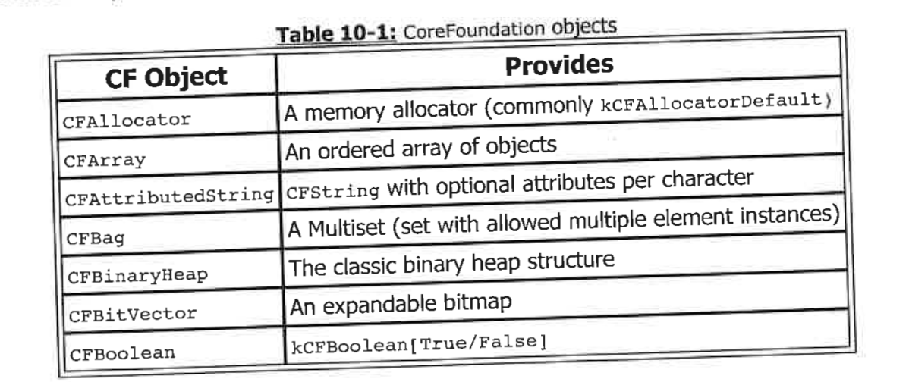
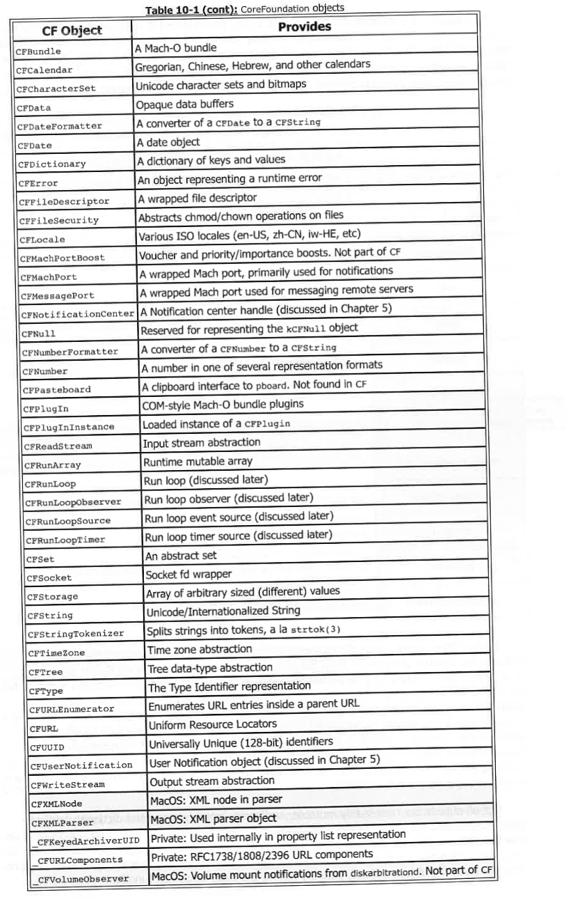

All classes are instances of `CFRuntimeClass`, preinitialized in CoreFoundation's `_DATA._const`,  
and registered at runtime by calling `CFRuntimeRegisterClass`.  
This call returns an index into the `CFRuntimeClassTable`, and it is this index which serves as the class's `TypeID`,  
making the identifier unsafe to hard-code as a constant integer\*.  
The `CFRuntimeClass` object is defined in CF's `CFRuntime.h` as shown in Figure 10-2:

所有类都是 `CFRuntimeClass` 的实例，预初始化于 `CoreFoundation` 的 `_DATA._const` 区段中，  
并在运行时通过调用 `CFRuntimeRegisterClass` 注册。  
该调用会返回一个在 `CFRuntimeClassTable` 中的索引，这个索引即作为该类的 `TypeID`，  
因此不建议将该标识符硬编码为一个固定整数\*。  
`CFRuntimeClass` 对象的定义位于 `CF` 的头文件 `CFRuntime.h` 中，如图 10-2 所示：

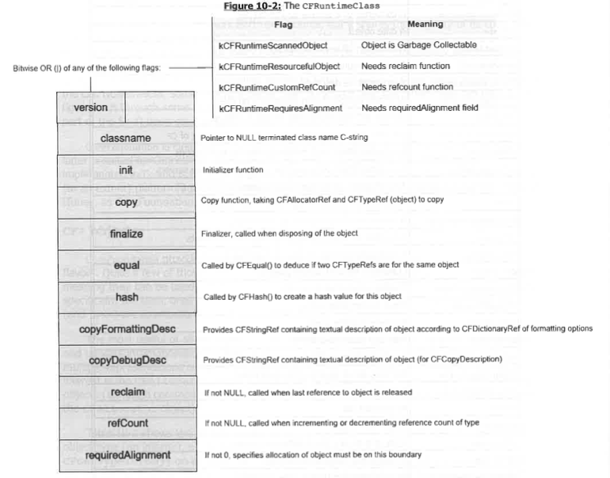

Using `CRuntimeClass` allows the class implementations to remain relatively opaque.  
Indeed, the internal structure of the `CF` objects is not meant to be relied on in any way — accessing objects should only be performed using exported functions.  
This normally suffices, but the `_CFObjectTypeCopyDescription()` method during registration, which can be accessed through the exported `CFCopyDescription()`, returns a `CFStringRef` for debugging (normally used automatically by `lldb`'s `po` command).  
Another option is the `CFShow()` function, which can be used to dump a textual representation of any `CoreFoundation` object to `stderr`.  
One can get over this minor annoyance by `dup2(1, 2)` (that is, merging `stderr` with `stdout`).  
It's unfortunate that `CFShowToFile()` (which `CFShow()` is a simple wrapper for) is not exported.  

使用 `CRuntimeClass` 使得类的实现保持相对不透明。  
实际上，`CF` 对象的内部结构不应依赖于任何方式 —— 访问这些对象应仅通过导出的函数。  
通常情况下，这样的做法已经足够，但在注册过程中，`_CFObjectTypeCopyDescription()` 方法可以通过导出的 `CFCopyDescription()` 访问，  
它会返回一个 `CFStringRef` 用于调试（通常会被 `lldb` 的 `po` 命令自动使用）。  
另一种选择是 `CFShow()` 函数，它可以将任何 `CoreFoundation` 对象的文本表示输出到 `stderr`。  
你可以通过 `dup2(1, 2)` 来解决这个小问题（即将 `stderr` 与 `stdout` 合并）。  
遗憾的是，`CFShowToFile()`（`CFShow()` 的简单封装函数）并没有被导出。

Not all objects are necessarily mutable, and some (notably, `array` and `dictionary`) exist in both mutable and non-mutable variants.  
All objects have built-in reference counts.  
Depending on how the object reference is obtained, it may need to be `CRetain()` (if obtained with a `CF..Get..` function) and call `CFRelease()` (if retained or owned).  
When the reference count drops to zero, the object is freed, possibly calling the class reclaim function.

并非所有对象都是可变的，一些对象（尤其是 `array` 和 `dictionary`）同时存在可变和不可变的变种。  
所有对象都有内建的引用计数。  
根据获取对象引用的方式，可能需要通过 `CRetain()` 来增加引用计数（如果通过 `CF..Get..` 函数获取），  
并在适当时机调用 `CFRelease()` 释放对象（如果该对象已被保留或拥有）。  
当引用计数降至零时，对象将被释放，并可能调用该类的回收函数。

* Because initialization is largely deterministic, the numbers are in fact constant. But due to different classes in MacOS and iOS, all but the primitive objects get renumbered.

* 因为初始化过程大多是确定性的，所以这些数字实际上是常量。但由于在 MacOS 和 iOS 中有不同的类，除了原始对象外，其他对象都会重新编号。

## Run Loops

The run loop is a pivotal concept of the `[Core]Foundation` programming model. As befitting its importance, Apple provides ample documentation on its use, yet still stops short of discussing its actual implementation.  
The runtime provides one `CRunLoop` object per thread, which is stored in `CoreFoundation`'s Thread Specific Data (TSD) and accessible by simply calling `CFRunLoopGetCurrent()`.  

run loop是 `[Core]Foundation` 编程模型中的一个关键概念。正因为其重要性，Apple 提供了大量关于其使用的文档，但仍未深入讨论其实际实现。  
运行时为每个线程提供一个 `CRunLoop` 对象，该对象存储在 `CoreFoundation` 的线程特定数据（TSD）中，并可以通过简单地调用 `CFRunLoopGetCurrent()` 来访问。

Threads aren't strictly required to use their associated runloops, but the main thread often does: It is common practice for most applications to perform their startup/initialization sequence in their main thread, setting up any input sources, and then enter the main thread's runloop (via `CFRunLoopRun()`, a variant, or the Objective-C `NSRunLoop` wrapper) as the last action.  
Run loops executed with the default `CRunLoopRun()` are assumed to be endless; If/when one does exit, the function returns, which normally terminates the thread, and — in the case of the main thread — exits the application. Using any of the variants, however, it is possible to enter the run loop for a single iteration.  
Figure 10-3 shows the possible ways of entering a run loop:

线程并不严格要求使用其关联的 run loops，但主线程通常会使用：大多数应用程序的常规做法是在主线程中执行启动/初始化序列，设置任何输入源，然后以进入主线程的run loop（通过 `CFRunLoopRun()`、某种变体或 Objective-C 的 `NSRunLoop` 封装）作为最后一步。  通过默认的 `CRunLoopRun()` 执行的run loop通常被认为是无限的；如果/当某个run loop退出时，函数会返回，这通常会终止该线程，若是主线程则会退出应用程序。然而，使用任何变体，都可以让run loop只执行一次迭代。  
图 10-3 显示了进入run loop的可能方式：

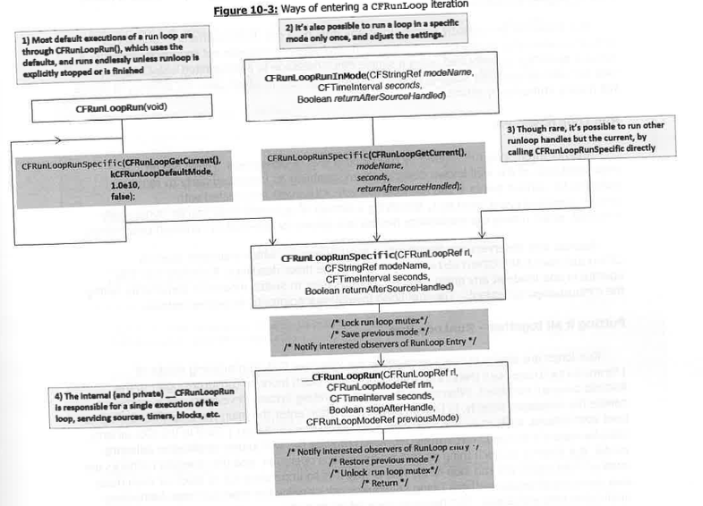

### Run Loop sources  
At a high level, a run loop can be thought of as an enhancement of the traditional model of a `select(2)` or `poll(2)` loop, which traditionally work with `fd_set` or `pollfd` collections of descriptors.  
Run loops extend the notion past that of simple file descriptors, supporting a wide variety of run loop sources, which include:  
- `CFFileDescriptors` and `CFSockets`  
- `CFMachPorts` - Converting Mach notification ports to runloop sources is common practice, and is straightforward when the ports are already boxed by `CFMachPort` objects. Some functions, like IOKit's `IONotificationPortGetRunLoopSource()` handle the conversion as well.  
- `CFMessagePort` - are similar to Mach ports, but also provide the ability to send messages (`CFMessagePortSendRequest()`) to remote ports (found via bootstrap/XPC lookup).  
- `CFUserNotification` - for user notification responses, as described in Chapter 5.  
- `CFRunLoopTimer` - built-in timer objects which may be set to fire once or periodically.  

从高层次来看，run loop 可以被看作是传统 `select(2)` 或 `poll(2)` 循环的扩展，传统上它们与 `fd_set` 或 `pollfd` 集合的描述符一起工作。  
run loops扩展了这一概念，不仅限于简单的文件描述符，支持多种不同类型的run Loop sources，包括：  

- `CFFileDescriptors` 和 `CFSockets`  

- `CFMachPorts` - 将 Mach 通知端口转换为run Loop sources是常见做法，当端口已经由 `CFMachPort` 对象封装时，这一过程也非常简单。一些函数，如 IOKit 的 `IONotificationPortGetRunLoopSource()`，也会处理这种转换。  

- `CFMessagePort` - 类似于 Mach 端口，但还提供了将消息（`CFMessagePortSendRequest()`）发送到远程端口的能力（通过 bootstrap/XPC 查找）。  

- `CFUserNotification` - 用于用户通知响应，如第 5 章所述。  

- `CFRunLoopTimer` - 内置定时器对象，可以设置为一次性触发或定期触发。  

  

It is also possible to create custom `CRunLoopSources`, by providing a `CFRunLoopSourceContext*` to it, which provides the standard `CF*` object callbacks, along with source-lifecycle ones, notably `perform()`, which is invoked when the source fires (predefined sources populate their `perform()` internally, in their constructor).  
The `perform()` handler usually handles one source event instance directly, but may also enqueue blocks (using `CFRunLoopPerformBlock()`) to run after the source fires.  
Run loops can be explicitly woken up at any time by a call (from a different context) to `CFRunLoopWakeUp()` on the `CFRunLoopRef`, though the run loop can opt to ignore wakeups. A wakeup operation is performed using a simple Mach message to a designated `wakePort`.  
A run loop can also be explicitly stopped (using `CFRunLoopStop()`), in which case any attempt to iterate will merely immediately return.

也可以通过提供 `CFRunLoopSourceContext*` 来创建自定义的 `CRunLoopSources`，它提供标准的 `CF*` 对象回调以及源生命周期回调，尤其是 `perform()`，当源触发时会调用该方法（预定义的源在构造函数中会内部填充 `perform()`）。  
`perform()` 处理程序通常直接处理一个源事件实例，但也可以使用 `CFRunLoopPerformBlock()` 将块排队，在源触发后执行。  
run loops可以通过从不同上下文调用 `CFRunLoopWakeUp()` 来显式唤醒，尽管run loops可以选择忽略唤醒。唤醒操作通过向指定的 `wakePort` 发送一个简单的 Mach 消息来执行。  
run loop还可以通过调用 `CFRunLoopStop()` 显式停止，在这种情况下，任何尝试进行迭代的操作都会立即返回。

### Run Loop observers  
Another interesting API offered by run loops is that of **observers**. These are an implementation of the well-known design pattern, enabling an interested party to register callbacks for various points in the run loop lifecycle.  
Observers are created with `CFRunLoopObserverCreate()`, specifying a bitmap of activities. They can be dynamically removed, which makes the mechanism flexible and allows for one-shot or repeated observation.  

run loops 提供的另一个有趣的 API 是**观察者（observer）**机制。它实现了经典的设计模式，允许相关方在run loop生命周期的各个阶段注册回调函数。  
观察者通过 `CFRunLoopObserverCreate()` 创建，并通过位图指定所感兴趣的活动类型。观察者可以动态移除，使得这一机制非常灵活，既可以用于一次性观察，也支持重复观察。  

Sources and observers are placed into a **RunLoopMode**, which maintains them in `CFMutableSets` and `CFMutableArrays`, as well as the timer deadlines.  
A run loop can only operate in one mode at any given iteration, but it is easy to switch modes on demand by calling the `CFRunLoop...` variants.  
The run loop maintains a pointer to its `currentMode`.

源（sources）和观察者（observers）被加入到某个 **RunLoopMode（run loop模式）** 中，该模式将它们保存在 `CFMutableSets` 和 `CFMutableArrays` 中，同时还包括定时器的触发时间。  
每次run loop迭代只能在一个模式下运行，但可以通过调用不同的 `CFRunLoop...` 变体按需切换模式。  
run loop内部会维护一个指向当前模式 `currentMode` 的指针。

### Putting it all together - RunLoop, Run   总结 —— RunLoop 与 Run 的协作

Run loops are similar in some respects to the Windows GUI programming model of  [Translate/Dispatch]Message main loops, and much more so (unsurprisingly) to the  Android **Looper** construct. Whereas in the other operating system developers are expected to  handle the messages directly, in Darwin developers often enter the main run loop through higher  level abstractions, such as **AppKit.framework**'s `NSApplicationMain()` (and in the iOS variants,  **UIKit.framework**'s `UIApplicationMain()`), which provide the well-known **application delegate**  model. But there is no such thing as true asynchronous operation, and the delegate callbacks are  invoked from within the run loop itself.  

run loops（**Run Loop**）在某些方面类似于 Windows GUI 编程模型中的  [`TranslateMessage`/`DispatchMessage`] 主循环，在结构上又更接近 Android 中的  **Looper** 构造。这些平台通常要求开发者直接处理消息，而在 **Darwin** 系统中， 开发者通常是通过更高层的抽象接口进入主run loops的，例如 macOS 中  **AppKit.framework** 提供的 `NSApplicationMain()`，以及iOS 中  **UIKit.framework** 提供的 `UIApplicationMain()`。这些函数共同构成了众所周知的  **应用代理（application delegate）** 模型。

但需要注意的是，所谓的“异步操作”并非真正脱离run loops存在，所有  **代理方法（delegate method）** 的回调实际上都是在run loops内部被调用的。  

This is why it is so imperative not to block or even delay execution in a **delegate method**:  Doing so would block or delay the main **run loop**, hampering application responsiveness.  This becomes clear when inspecting `_CERunLoopRun(...)`, shown in Listing 10-4 (next page),  which is a (grossly) simplified excerpt of **CoreFoundation**'s implementation.  

这也正是为何**在代理方法中切忌阻塞或延迟执行**——否则会阻塞或拖慢主  **Run Loop** 的执行，严重影响应用的响应性。通过查看 `_CERunLoopRun(...)` 的实现（参见下一页的代码示例 Listing 10-4），  
这一点就更加明显了。该函数是 **CoreFoundation** 中run loops实现的一个（极度）简化版本。  

The callouts in the **CFRunLoop** lifecycle use `CFRUNLOOP_IS_CALLING_OUT_TO...`  
symbols, which stand out in stack backtraces and facilitate debugging the run loop lifecycle.

在 **CFRunLoop** 生命周期中，系统使用 `CFRUNLOOP_IS_CALLING_OUT_TO...`  这样的符号标记各类回调阶段，这些符号在堆栈回溯中非常显眼，有助于开发者调试run loops的行为和生命周期。

•	There are also two API versions of CRunLoopSources (0 and 1), but those only have minor differences (i.e. v0 provides a schedule/cancel functions, whereas v1 provides access to underlying mach_port_t)

⸻
•	CRunLoopSources 有两个 API 版本（v0 和 v1），但它们之间只有一些细微差别 —— 例如，v0 提供了 schedule / cancel 函数，而 v1 则提供了对底层 mach_port_t 的访问能力。

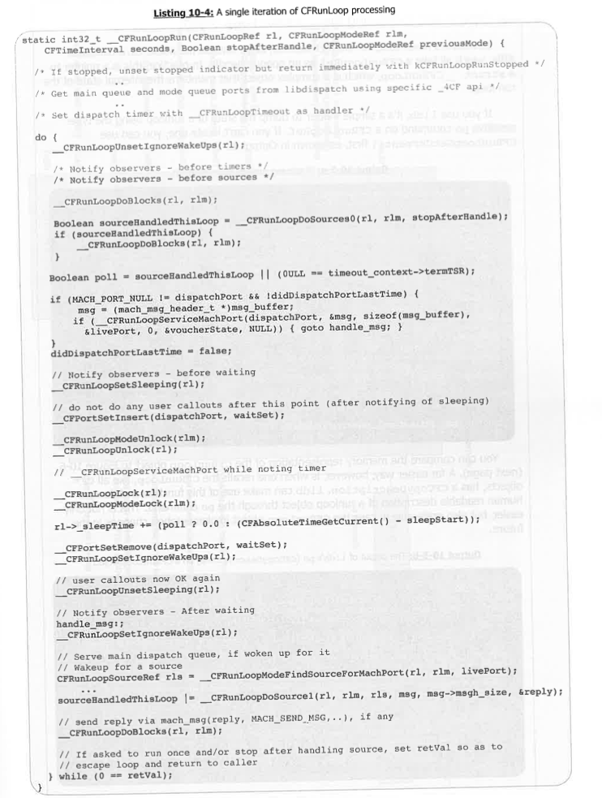

#### 实验：检查 `_CRunLoop` 对象

开发者在使用 **CoreFoundation** 的公开 API 时，通常不会直接接触或操作 **run loops**，因为所有接口都将 **`CRunLoopRef`** 作为一个不透明的句柄传递。实际上，这个句柄是一个指向 **`_CRunLoop`** 结构体的指针，该结构体是一个复杂的对象，用于维护 **run loop** 的内部状态。

如果使用 **`lldb`**，可以通过类型感知的 **`po` 命令** 来输出某个 **`CFRunLoopRef`** 的状态。如果你找不到一个可用的 **run loop** 引用，可以先调用 **`CFRunLoopGetCurrent()`** 获取当前线程的 **run loop**，如 Output 10-5 所示。
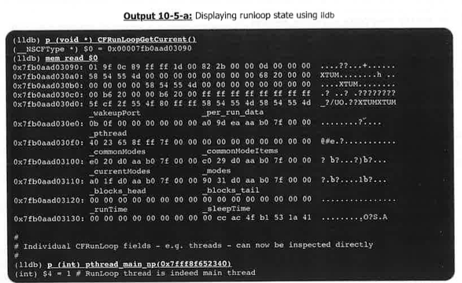
### 原文（Original）

You can compare the memory representation of the `CFRunLoop` object to Figure 10-6 (next page). A far easier way, however, is when one recalls the `CRunLoop`, like all `CF*` objects, has a `CFCopyDescription`. `lldb` can make use of this function and dump a human readable description of a runloop object through the `po` command. This is not only easier, but also preferable in case the `CRunLoop` object implementation changes in the future.

### 翻译（Translation）

你可以将 **`CFRunLoop`** 对象的内存表示与图 10-6（下一页）进行对比。但更简单的方法，是记住 **`CRunLoop`**（和所有 **`CF*` 对象** 一样）实现了 **`CFCopyDescription()`** 方法。**`lldb`** 可以利用这个函数，通过 **`po` 命令** 输出一个 **run loop** 对象的可读描述。

这种方式不仅更简单，而且更推荐使用，尤其是考虑到未来 **`CRunLoop`** 对象的实现可能会发生变化。
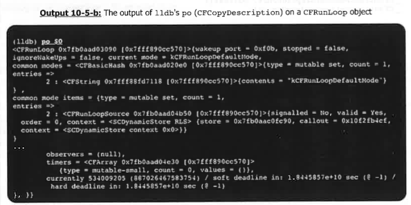

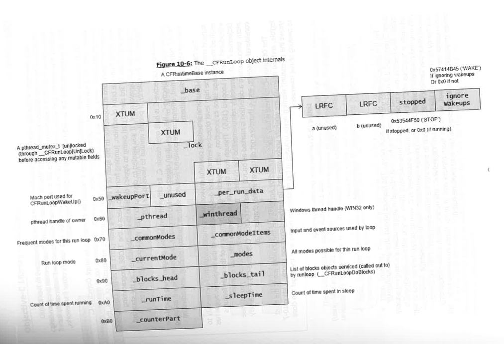

实验一结束。

### Objective-C  

Any developer struggling with **Objective-C** owes her trials and tribulations to NeXT.  
**Objective-C** was little known or used outside **NeXTSTEP**, but became Apple's main programming language as **NeXTSTEP** metamorphosed into **OS X**. **NeXT** had used **Objective-C** extensively for their UI frameworks, and when those became ingrained in **Cocoa** and Apple's other frameworks, the language became the de facto standard for **OS X** development.  

任何在使用 **Objective-C** 时遇到困难的开发者，都应该将她的所有挫折归功于 **NeXT**。  
**Objective-C** 在 **NeXTSTEP** 之外几乎鲜为人知，但随着 **NeXTSTEP** 转变为 **OS X**，它成为了苹果的主要编程语言。**NeXT** 在其 UI 框架中广泛使用 **Objective-C**，而这些框架在 **Cocoa** 和苹果的其他框架中深入根植，使得这种语言成为 **OS X** 开发的事实标准。  

**OS X**, however, wasn't significant enough a reason for developers to adopt **Objective-C**. What more, **OS X** still allowed programming in other languages - developers could choose **Carbon APIs** over **Cocoa**, and stick to **C/C++**. It was thus not until the introduction of **iOS**, that **Objective-C** exploded in popularity. In the span of a little over a year (2011 to 2012), **Objective-C** was saved from the brink of oblivion, jumping from 46th place in the **TIOBE programming language index** to 3rd place(!), all owing to Apple's decision to use **Objective-C** as the standard language for **iOS** development. If you wanted to develop for **iOS**, you would have to use **Objective-C**. And plenty of people wanted to develop for **iOS**.  

然而，**OS X** 本身并不足以让开发者采纳 **Objective-C**。更重要的是，**OS X** 仍然允许使用其他语言进行编程——开发者可以选择使用 **Carbon APIs** 而非 **Cocoa**，并继续使用 **C/C++**。直到 **iOS** 的推出，**Objective-C** 才真正爆发式增长。在短短一年多的时间里（2011 到 2012 年），**Objective-C** 从 **TIOBE 编程语言指数** 的第46位跃升至第3位！这完全得益于苹果决定将 **Objective-C** 作为 **iOS** 开发的标准语言。如果你想为 **iOS** 开发，你就必须使用 **Objective-C**，而且有大量的人希望为 **iOS** 开发。  

Although **Objective-C** is built over classic **C**, its different syntax and programming model are not as intuitive. **Objective-C**, like **C++**, is an object-oriented language, but many view it as being "truly" object oriented, offering more powerful features such as runtime binding, and adhering more strictly to design patterns.

虽然 **Objective-C** 是基于经典的 **C** 构建的，但它不同的语法和编程模型并不那么直观。**Objective-C** 和 **C++** 一样，都是面向对象的语言，但许多人认为它是真正的面向对象，提供了更强大的特性，比如运行时绑定，并且更加严格地遵循设计模式。

The **Objective-C** runtime provides a powerful environment complete with the functionality to support many of the high level object-orientation and design patterns of the language. **Apple** has evolved the language since its inception, with **Objective-C 2.0** being one of the main features introduced back in **Leopard (10.5)**. Though from the user perspective little has changed, **Objective-C 2.0** completely reimplemented the runtime. If you peruse the sources, you will see many places where a definition is marked as **OBJC2_UNAVAILABLE**. **Objective-C 1.0** is largely considered obsolete, and is therefore not discussed in this chapter at all.  

**Objective-C** 运行时提供了一个强大的环境，具备支持语言中的许多高级面向对象和设计模式的功能。自语言诞生以来，**Apple** 一直在不断发展它，**Objective-C 2.0** 是 **Leopard (10.5)** 中引入的主要特性之一。虽然从用户的角度来看变化不大，但 **Objective-C 2.0** 完全重新实现了运行时。如果你浏览源代码，你会看到许多地方的定义被标记为 **OBJC2_UNAVAILABLE**。**Objective-C 1.0** 已被普遍认为过时，因此在本章中并未讨论。  

The **Objective-C** runtime is fully open sourced by **Apple**, yet the sources aren't the most legible, and the internals are woefully undocumented. To further discourage people, Listing 10-7 shows the (verbatim) warning **Apple** includes in the headers for people who try to get too close to peeking at the internals:

**Apple** 完全开源了 **Objective-C** 运行时，但源代码并不十分易读，内部实现也严重缺乏文档。为了进一步劝阻开发者，**Listing 10-7** 显示了 **Apple** 在头文件中包含的警告（逐字复制），警告那些试图过度窥探内部实现的人：

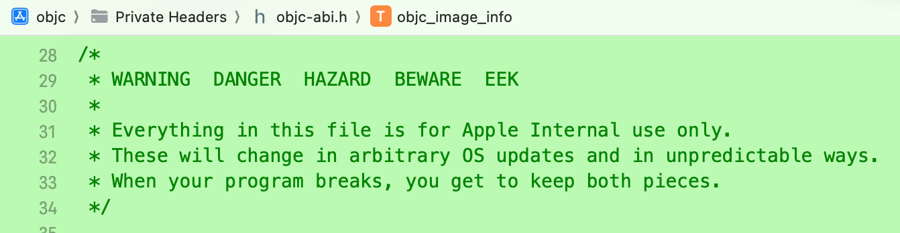

> \* 警告 危险 危害 注意 哎呀
>
> *本文件中的所有内容仅供 Apple 内部使用。
>
> *这些内容可能会在任意的系统更新中以不可预测的方式发生变化。
>
> *当你的程序因此崩溃时，碎片就归你自己所有了.

For the brave, however, there is good news - The headers haven't changed significantly since **Objective-C 2.0** was introduced. The **ABI** and internal implementation are thus remarkably stable. And there is much to be gained by understanding them. As you will see, **Objective-C** is not really a "superset of C". It is syntactically equivalent to **C**, with its unique bracket and at-sign (**@**) oriented notations translated by the compiler into ANSI **C**. The undocumented **-rewrite-objc** (which was introduced as a method to peek into the implementation of blocks) comes in very handy for unraveling the code behind **Objective-C**. The output, which involves expanding preprocessor macros as well, will be far more copious and, at times, barely comprehensible - but proves invaluable for understanding the low level implementation.

然而，对于勇敢者来说，有一个好消息——自从 **Objective-C 2.0** 引入以来，头文件的变化并不显著。因此，**ABI** 和内部实现非常稳定。而且，通过理解这些内容，开发者能够获得很多有用的信息。正如你将看到的，**Objective-C** 并不是一个“C 的超集”。它在语法上等同于 **C**，其独特的括号和 at 符号 (**@**) 定向符号会被编译器转化为 `ANSI C`。未公开的 **-rewrite-objc**（它是用来窥探块实现的一种方法）在解开 **Objective-C** 背后的代码时非常有用。生成的输出将包括展开预处理器宏，通常内容会更加庞大，有时甚至难以理解——但它对理解低层实现至关重要。

### Objective-C Library initialization
**Objective-C 2.0** declares an explicit constructor (that is, a function which must be manually called, rather than be automatically invoked by dyld during linking) called `objc_init`. Initialization consists of several stages, shown in Figure 10-8:

**Objective-C 2.0** 声明了一个显式构造函数（即，必须手动调用的函数，而不是在链接时由 **dyld** 自动调用），该函数名为 `objc_init`。初始化过程包括多个阶段，如图 10-8 所示：
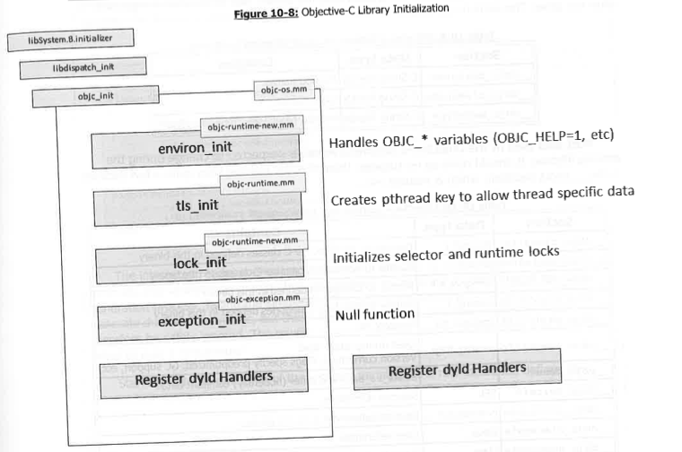

The most important stage is the last one - registering dyld state change handlers. Doing so (using APIs discussed in Chapter 7) allows the runtime to keep abreast of any dylibs loaded or unloaded by the process. In all, three stage change handlers are registered:
- **load_images**: iterates over the loaded Mach-O, preparing and calling any `+load` methods found in them.
- **map_images**: This performs the most work. It first discovers any classes, selectors, and protocols in the mapped images. It then proceeds to realize any classes marked "Non-Lazy"(that is, in the `__DATA.__objc__nlclslist` section), before going on to discover any categories.
- **unmap images**: Removes any unattached categories in images which are to be supported, the detach and of any dangers in the unused garbage collection is supported, the `__DATA` and `__OBJC ` segments are unregisterd.

It is the class realization step of map_images which is the most important: "Realizing" a class refers to the process of loading the class data from the Mach-O representation into memory, as discussed next.

最重要的阶段是最后一个——注册 **dyld** 状态变化处理程序。这样做（使用第 7 章讨论的 API）可以让运行时跟踪进程加载或卸载的任何 **dylibs**。总共注册了三个阶段的变化处理程序：
- **load_images**：遍历已加载的 Mach-O 文件，准备并调用其中发现的任何 `+load` 方法。
- **map_images**：这个过程完成了大部分工作。它首先会在已映射的镜像（images）中**发现所有类、选择器（selectors）和协议（protocols）**。接着，它会初始化所有被标记为“非延迟加载（Non-Lazy）”的类（即位于 `__DATA.__objc_nlclslist` 区段中的类），然后再继续**查找所有的 Category（分类）**。
- **unmap images**：移除图像中未附加的 Category（类别）；对支持的情况下，还会解除未使用的垃圾收集对象的绑定；`__DATA` 和 `__OBJC` 段将被取消注册。

在 **map_images** 阶段，最重要的步骤是类的“Realizing实现”：所谓“实现”一个类，是指将该类的数据从 Mach-O 表示加载到内存中，如下文所讨论的那样。

## Runtime support information 运行时支持信息

Recall, that the Mach-O `__TEXT` segment is mapped r-x in memory. The Objective-C runtime piggybacks on the fact that this is a read-only mapping, and stores immutable C-String data in several sections within this segment. This is similar to the Mach-O's own `__TEXT.__cstring` section, with the format being the same - Null terminated strings, one after the other. The sections are shown in Table 10-9: 

回想一下，Mach-O 的 `__TEXT` 段在内存中是以 **r-x** 映射的。Objective-C 运行时利用这一只读映射的特点，在该段内存中的多个部分存储不可变的 C 字符串数据。这与 Mach-O 自身的 `__TEXT.__cstring` 部分类似，其格式相同——每个字符串都是以 Null 终止符结尾，依次排列。各个部分如表 10-9 所示：
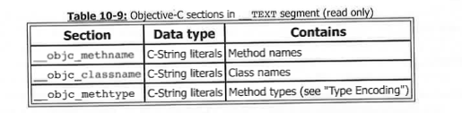

Most data used by the Objective-C runtime is mutable - expected to change during the process lifetime. It should come as no surprise, then, that the runtime uses quite a few sections in the `__DATA` segment, which is marked rw-.

Objective-C 运行时使用的大多数数据是可变的——预期在进程生命周期中会发生变化。因此，运行时在 `__DATA` 段中使用了相当多的部分，而该段被标记为 **rw-**。

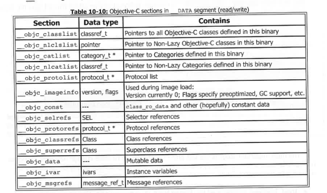

The names of the sections are reserved, as they are hardcoded into libobjc.dylib (by GETSECT macros, in objc-file.mm). As shown in the table, each of the data sections is essentially a top-level structure, but to better understand them, we are starting at a sample `_data`, Objective-C program, and following the process of its compilation, until the eventual generation of the Mach-O.

这些段的名称是保留的，因为它们在 `libobjc.dylib` 中是硬编码的（通过 `objc-file.mm` 中的 `GETSECT` 宏）。如表中所示，每个数据段本质上都是一个顶层结构。为了更好地理解它们，我们将从一个示例 Objective-C 程序开始，逐步跟踪其编译过程，直到最终生成 Mach-O 文件。