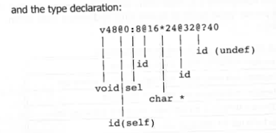

## Type Encoding  类型编码
Note the method definitions in the previous listing: Objective-C uses mangling to encode selector and variable types. This syntax (defined in libobjc’s runtime.h) makes it easy to encode both simple and complex types, although sometimes at the cost of readability. It is documented by Apple in the Objective-C Runtime Programming Guide, and can be summarized by the following rules:

- Primitive data types are defined by single characters, which correspond to their first letter of the type (e.g. `l`/`i`/`s`/`c` for long/integer/short/char), with an uppercase letter denoting the unsigned variant (e.g. `L` for unsigned long, etc).
- Other data types whose first letter would conflict use other letters. Thus, long long uses `a` (or `Q` for unsigned). Additional special cases include bitfields (`b`), booleans (`B`), classes (`#`), `id` (`@`), char pointers (`*`), generic pointers (`^`), and undefined (`?`, usually).
- Arrays, structures and unions use `[` `{` and `(` to begin and the corresponding right delimiters to end.

The compiler directive `@encode` can be used to create a type-encoding from a given data type, but its use is limited as it is a compile-time (preprocessor) directive. Unfortunately, there is no quick method to decode. The method declarations (in `_TEXT._objc_methtypes`)…  
As an example, consider a method from the private `StreamingZip.framework` with the selector:  
`setupUnzipperWithOutputPath:sandboxExtensionToken:options:withReply:`


注意前面代码中的方法定义：Objective-C 使用名称改写（mangling）方式对 *selector* 和变量类型进行编码。这种语法定义在 `libobjc` 的 `runtime.h` 中，它让对简单或复杂类型的编码变得容易，虽然有时候会牺牲可读性。Apple 在《Objective-C Runtime Programming Guide》中对此做了文档说明，可总结如下规则：

- 原始数据类型由单个字符表示，通常对应类型的首字母（例如 `l`/`i`/`s`/`c` 分别代表 long/int/short/char），大写表示无符号版本（如 `L` 表示 unsigned long 等）。
- 如果首字母冲突，则使用其他字符。例如，long long 使用 `a`（或无符号版本用 `Q`）。其他特殊情况还包括：位字段（`b`）、布尔值（`B`）、类（`#`）、`id`（`@`）、char 指针（`*`）、通用指针（`^`）和未定义类型（`?`，常见于未知类型）。
- 数组、结构体和联合体使用 `[`、`{` 和 `(` 作为起始符号，右侧使用对应符号闭合。

编译指令 `@encode` 可用于根据给定数据类型生成类型编码，但它是编译期（预处理器）指令，使用场景有限。不幸的是，Objective-C 并没有提供快速的解码方法。方法声明（通常在 `_TEXT._objc_methtypes` 段中）…  
例如，来看一个来自私有框架 `StreamingZip.framework` 的方法，其 selector 是：  
`setupUnzipperWithOutputPath:sandboxExtensionToken:options:withReply:`



The method declaration begins with the return value – in this case `void`. Following that is the number of bytes used by all arguments – in the above, 48 bytes. As with all methods, the first two arguments are `self` (the `@` at offset 0) and the selector (`:` at offset 8). Arguments appear after the selector, and so we have an `id` (at byte 16), a char pointer (at byte 24), another `id` (at byte 32), and another `id` (undefined, block) at byte 40.  
Combining the selector definition and the type declaration yields:

方法声明以返回值开始——在这个例子中是 `void`。紧随其后的是所有参数所占的总字节数——本例中是 48 字节。和所有方法一样，前两个参数分别是 `self`（偏移量 0 处的 `@`）和 selector（偏移量 8 处的 `:`）。selector 之后是实际的参数：一个 `id`（位于字节 16）、一个 char 指针（位于字节 24）、另一个 `id`（位于字节 32）以及另一个 `id`（未明确定义，实际为 block，对应字节 40）。

结合 selector 的定义和类型声明，可以得到完整的编码信息。


The byte offsets are a relic of the legacy convention for passing arguments through the stack frame, and can generally be ignored, as they are maintained only for compatibility.  
The encoded types, however, prove very useful as they help reverse the otherwise unknown types of arguments. Along with the naming of arguments in the selector, this makes it fairly easy to figure out the APIs of objects in Apple’s binaries and particularly the private frameworks (as is shown in an upcoming experiment).

字节偏移量是过去通过栈帧传递参数所遗留下来的传统，可以基本忽略，它们现在仅用于兼容性目的。  
但类型编码本身非常有用，它可以帮助我们反推参数的真实类型。结合 selector 中的参数命名，我们可以较为轻松地识别 Apple 二进制文件中的对象 API，尤其是私有框架中的 API（稍后章节中将通过实验演示）。


## Classes 类

Methods and variables belong to classes. But a "class" implementation in most languages is really nothing more than an in-memory structure, with fields for "properties" and function pointers for "methods". Objective-C isn't all too different in this regard, implementing its classes as structures as well.  
Objective-C 2.0 classes are, in and of themselves, objects. They are represented by a compact structure, which contains fields pointing to their metaclass (for the `isa` operation), their superclass, the method cache (used when sending messages, and discussed later), and the class data.

方法和变量都归属于类。但在大多数编程语言中，所谓的“类”实现其实只是一个内存结构，结构体中包含表示“属性”的字段和表示“方法”的函数指针。在这一点上，Objective-C 与其他语言并无太大不同，它也是用结构体来实现类的。

在 Objective-C 2.0 中，类本身就是对象。它们通过一个紧凑的结构体表示，该结构体包含若干字段，用于指向其 *元类*（用于 `isa` 操作）、*父类*、*方法缓存*（用于消息发送，后文将讨论）以及 *类数据*。


The class data field redefines the unused bits in the pointer as "FAST" flags, for quick decision making (notably, marking classes with default retain/release (RR), and differentiating Swift classes).  
In the 32-bit case these consist of only the two least significant bits (since pointers are 4-byte aligned).  
In the 64-bit case, another bit can be used (since pointers are 8-byte aligned) to mark classes with a non-pointer isa field.  
Non-pointer isas repurpose most of the pointer bits so that the actual pointer value needs to be extracted and shifted from within the isa value, shown in Table 10-13:

类的数据字段会将指针中未使用的位重新定义为所谓的 “FAST” 标志，用于快速决策（例如：标记是否使用默认的 retain/release（RR）行为，或区分 Swift 类）。

在 32 位系统中，由于指针按 4 字节对齐，因此只有最低的两位可供使用。  
而在 64 位系统中，指针按 8 字节对齐，可额外使用一位，用于标记该类是否使用 *非指针 isa*。  

非指针 isa 会重用指针的大部分位，因此需要从 isa 值中提取并移位还原出实际的指针值，这将在表 10-13 中展示。


The class data field, once the extra bits are masked, points to an additional structure, which describes the class itself.  
On disk, this is a `struct class_ro_t`, which contains the (hopefully) immutable attributes of the class, such as its name, base methods, properties, and instance variables.  
Once loaded into memory, an additional intermediate structure of `struct class_rw_t` is used, containing pointers to attributes which may be dynamically modified during runtime, such as additional methods, protocols, properties, and relatives in the class hierarchy.  
Figure 10-14 shows the relationship between the objects and their representation, both in the file and in memory.

在类的数据字段中，去除多余的标志位后，其实际指向的是一个用于描述类本身的附加结构体。

在磁盘中，这个结构体是 struct class_ro_t，它包含类的一些 **理应不可变的属性**，例如类名、基础方法、属性以及实例变量等。

而在加载到内存后，还会引入一个中间结构体 struct class_rw_t，它包含指向可以在运行时动态修改的属性的指针，例如新增的方法、协议、属性，以及类层级中的相关类等。

图 10-14 展示了这些对象在文件与内存中的表示方式及其之间的对应关系。


## Sending messages   发送消息

Objective-C's most prominent feature is its programming model of message passing, which reflects in its parentheses-laden syntax.  
Rather than invoking a method directly, you send the object instance a message. Most developers don't pause to reflect on the difference, since the functionality is very similar – in both cases, a functional unit will be executed, with arguments.  

Message passing, however, is not entirely identical to invoking a function.  
Unlike functions, messages are constructed and resolved during runtime. The message selector is nothing more than a simple C-string, from which the runtime can deduce the corresponding handler. Said handler may be implemented at the instance level, the class level, or that of any ancestor in the class hierarchy.  

The syntax – `[object message]` – is rewritten by the compiler as a call to `objc_msgSend`.  
The rewritten code is shown in Listing 10-16:

Objective-C 最突出的特性之一是它的消息传递编程模型，这也体现在它充满括号的语法上。  

在 Objective-C 中，开发者并不是直接调用一个方法，而是向一个对象实例“发送消息”。  
大多数开发者可能不会特别在意两者的区别，因为从功能上来看，它们确实非常相似 —— 都是执行一个功能单元，并传入参数。

然而，消息传递并不完全等同于函数调用。  
与函数不同的是，消息是在**运行时**构造并解析的。消息选择器（selector）本质上就是一个简单的 C 字符串，运行时根据这个字符串来推导出对应的处理函数。这个处理函数可能实现于对象实例、类本身，或是类继承体系中的某个祖先类。

语法形式 `[object message]` 会被编译器重写为对 `objc_msgSend` 的调用。  
这个重写的代码见列表 10-16。


### 原文（Original）

Many programmers find the parentheses-based syntax frustrating, but a look at Listing 10-16 clearly shows it is by far preferable to the equivalent C code.  
The rules for rewriting are simple, and spare the developer from dealing with a fair amount of clutter:

- `[]` is expanded to `objc_msgSend`
- The object is passed as the first argument to `objc_msgSend()`
- The message selector is retrieved using `sel_registerName(name)` and passed as the second argument
- Any additional message arguments are passed in the following arguments (i.e. the third and later). These are easy to see, as the selector names specify additional arguments using ":" markers.
- The common practice of nesting `[]` (for example, `[[NS... alloc] init]`) is visible in code as a chaining of the first argument – `r0/x0` (iOS) or `rdi` (macOS).

The following experiment demonstrates the patterns of the auto-generated code as they appear in a disassembly.

---

### 翻译（Translation）

许多程序员对 Objective-C 的括号式语法感到困扰，但查看列表 10-16 后你会发现，这种语法其实远比等效的 C 代码更简洁。  
编译器对消息语法的重写规则非常简单，也让开发者省去了处理大量样板代码的麻烦：

- `[]` 会被展开为对 `objc_msgSend` 的调用
- 对象作为 `objc_msgSend()` 的第一个参数传入
- 消息选择器（selector）通过 `sel_registerName(name)` 获取，并作为第二个参数传入
- 任何额外的消息参数从第三个参数开始依次传入。这一点很好识别，因为 selector 名本身就通过 ":" 表示额外参数
- 嵌套消息（比如 `[[NS... alloc] init]`）在汇编代码中表现为参数链式传递 —— 在 iOS 上为 `r0/x0`，在 macOS 上为 `rdi`

接下来的实验展示了这些自动生成代码在反汇编中的典型模式。

## Message passing

### 原文（Original）

The heart of Objective-C is in sending messages, and so special care must be taken to ensure this is performed in the most efficient manner.  
The `runtime/Messengers.subproj` directory contains `objc-msg-arch.s` files with direct assembly implementations of `objc_msgSend`, optimized for each supported architecture (including Win32).

**The method cache**  
All classes make use of a method cache (as shown in Figure 10-14), which saves the implementations (i.e. function pointers) of already known methods.  
Initially, the method cache is set to `objc_empty_cache`, and as methods are invoked and resolved, they are added to the cache.  

Objective-C classes may have dozens of methods, but in practice only a small subset are frequently used, and those "hot" methods end up in the cache.  
A method can then be invoked following a quick lookup in the method cache, which is referred to as the "fast path".  

The `cache_t` (defined in `runtime/objc-runtime-new.h`) defines a number of buckets and a mask (applied over the selector) used to find the right bucket for a cached method.  

The fast path – implemented in the architecture assembly – finds the right bucket for the selector in question, and then checks to see if the method can be found.  
If so, it obtains its implementation, which can then be called.

---

### 翻译（Translation）

**消息传递**  
Objective-C 的核心在于发送消息，因此必须特别关注其执行效率。  
在 `runtime/Messengers.subproj` 目录下有多个 `objc-msg-arch.s` 文件，提供了针对不同架构（包括 Win32）的 `objc_msgSend` 汇编实现，以实现最高效的消息传递。

**方法缓存（method cache）**  
所有类都会使用一个方法缓存（如图 10-14 所示），用于保存已解析方法的实现（即函数指针）。  
方法缓存初始设置为 `objc_empty_cache`，随着方法被调用和解析后，会被加入缓存中。

虽然一个 Objective-C 类可能定义了数十个方法，但实际上频繁调用的只是其中一小部分。这些“热”方法最终都会进入缓存中。  
一旦缓存了方法，实现的调用就可以通过一次快速查找完成，这条路径被称为 **“fast path”**（快速路径）。

`cache_t`（定义在 `runtime/objc-runtime-new.h` 中）结构包含多个桶（bucket）以及一个掩码（mask），通过将选择器（selector）与掩码结合来定位该方法应在的桶位置。

快速路径在架构相关的汇编代码中实现。它会定位目标 selector 所对应的桶，并检查该桶是否存在目标方法。  
如果找到，便可直接获得其实现并调用。


### 原文（Original）

**The slow path**  
Objective-C objects begin their life with their cache empty – and it is therefore inevitable that the slow path first be taken while resolving methods.  
This path is implemented in C, and starts with `_class_lookupMethodAndLoadCache3`, which calls `lookupImpOrForward`, proceeding as shown (through pseudocode) in Listing 10-18:

---

### 翻译（Translation）

**慢路径（slow path）**  

Objective-C 对象在初始化时，其方法缓存（cache）为空——因此在解析方法时，首次调用势必会走 **“慢路径”**。  
慢路径是用 **C 语言** 实现的，入口函数为 `_class_lookupMethodAndLoadCache3`，它会调用 `lookupImpOrForward`，并按如下伪代码（见代码清单 10-18）继续执行：

```c
IMP lookupImpOrForward(Class cls, SEL sel) {
    // 1. 在类的方法列表中查找 selector 对应的方法实现
    IMP imp = search_method_list(cls, sel);
    if (imp) return imp;

    // 2. 如果当前类没有，就查找父类
    imp = lookup_in_superclass(cls, sel);
    if (imp) return imp;

    // 3. 如果仍未找到，就调用 forwarding 机制
    imp = get_forwarding_imp(cls, sel);
    return imp;
}
```


### 原文
Successful resolution populates the cache, so that future lookups can be sped-up. Lookup
failures lead to message forwarding, which calls the _obje_forward_handler. Unless set
externally, this defaults to objc defaultForwardHandler, which crashes the program using
_objc_fatal and a message of "_objc_fatal("%c[%s %s]: unrecognized selector sent to instance %p")" (as can be demonstrated by a simple one-liner of [NSObject
foo]).
A detailed discussion of the Objective-C 2.0 cache (and other Objective-C exploitation
techniques) can be found in a Phrack article by Nemo (#69-9)(7) and related presentation(8],

### 翻译
成功解析后会填充缓存，从而加快后续查找的速度。查找失败会导致消息转发，进而调用 _objc_forward_handler。除非外部设置了该处理器，否则它默认会指向 objc_defaultForwardHandler，该处理器会通过 _objc_fatal 导致程序崩溃，并显示如下消息：

_objc_fatal("%c[%s %s]: unrecognized selector sent to instance %p")

（这可以通过简单的一行代码 [NSObject foo] 来演示，因 NSObject 没有实现 foo 方法，导致崩溃。）

关于 Objective-C 2.0 缓存机制（以及其他 Objective-C 利用技术）的详细讨论，可以参阅 Nemo 在 Phrack 文章（第69期，第9篇）中的内容，以及相关的演讲资料。

## Other Compiler Directives

The syntactic sugar in Objective-C carries throughout the compilation process. For example, the Objective-C `@try`, `@catch`, and `@throw` directives get rewritten into:

- `objc_exception_try_enter`
- `objc_begin_catch`
- `objc_exception_throw`

Another example is the `@synchronized` construct, which also gets rewritten by the compiler:

### 其他编译器指令

在 Objective-C 中，语法糖贯穿整个编译过程。例如，Objective-C 的 `@try`、`@catch` 和 `@throw` 指令会被重写为：

- `objc_exception_try_enter`
- `objc_begin_catch`
- `objc_exception_throw`

另一个例子是 `@synchronized` 构造，它也会被编译器重写：


### 原文

In other words, the `@synchronized` block starts off with a call to `objc_sync_enter` on the lock, and then creates an object in this block - the `_SYNC_EXIT` - which ensures (in its destructor) that `objc_sync_exit` will be called when the block exits. To handle cases of an exception occurring within the block, the original contents are placed in a try/catch, and a second object - the `_FIN` - which makes sure any exception will be rethrown, but only after the original block has exited, and the `objc_sync_exit` has been called.

Going deeper into the implementation of `objc_sync_enter` and `objc_sync_exit` (in `runtime/objc-sync.mm`), one finds that these are nothing more than a mutex `lock` and a mutex `tryUnlock` with some sanity checks. All things considered, using the syntactic sugar `@synchronized` is indeed sweet, especially when faced with the alternative of manual coding.

### 翻译

换句话说，`@synchronized` 块首先会调用 `objc_sync_enter` 对锁进行加锁，然后在该块内创建一个对象 - `_SYNC_EXIT` - 确保（在其析构函数中）在块退出时会调用 `objc_sync_exit`。为了处理块内发生异常的情况，原始内容会放入 `try/catch` 中，另一个对象 - `_FIN` - 确保任何异常都会被重新抛出，但只有在原始块退出后，并且 `objc_sync_exit` 被调用之后。

深入研究 `objc_sync_enter` 和 `objc_sync_exit` 的实现（在 `runtime/objc-sync.mm` 中），可以发现这些其实不过是一个带有一些健全性检查的互斥锁 `lock` 和 `tryUnlock`。总的来说，使用语法糖 `@synchronized` 确实很方便，尤其是与手动编码相比。

## Reflection in Objective-C

The fact that methods in Objective-C are dynamically looked up, rather than being implemented in a static table, gives rise to one of Objective-C's most powerful features: **Reflection**. Similar to Java, reflection in Objective-C allows a program to be aware of its own (and other runtime) classes, enabling it to create, modify, and query them on the fly. The APIs are straightforward to use, and provide a flexible way to interact with objects at runtime.

### 反射

由于 Objective-C 中的方法是动态查找的，而不是在静态表中实现的，这使得 Objective-C 拥有了一个强大的特性：**反射**。与 Java 类似，Objective-C 中的反射允许程序在运行时了解自身（以及其他运行时）类的情况，从而能够动态地创建、修改和查询它们。这些 API 使用起来非常简单，并且提供了一种灵活的方式来与对象进行运行时交互。

### Introspection APIs

The following table (Table 10-20) lists some of the commonly used introspection APIs in Objective-C:

### Introspection APIs

以下是一些常用的反射 API：

| API                            | 描述                                                                 |
|--------------------------------|----------------------------------------------------------------------|
| `class_getName`                | 返回类的名称。                                                       |
| `class_getSuperclass`          | 返回指定类的超类。                                                   |
| `class_getInstanceMethod`      | 返回与给定类和选择器相关联的方法。                                     |
| `class_copyMethodList`         | 复制与类相关的所有方法。                                             |
| `class_addMethod`              | 在运行时将方法添加到类中。                                           |
| `class_getClassMethod`         | 返回给定选择器的类方法。                                             |
| `object_getClass`              | 返回对象的类。                                                       |
| `object_setClass`              | 在运行时改变对象的类。                                               |
| `objc_getClass`                | 返回指定类名的类对象。                                               |
| `objc_copyProtocolList`        | 返回给定类的所有协议列表。                                           |
| `sel_registerName`             | 注册一个新的选择器。                                                 |
| `objc_getAssociatedObject`     | 获取给定对象的关联对象。                                             |
| `objc_setAssociatedObject`     | 设置给定对象的关联对象。                                             |
| `method_exchangeImplementations`| 在运行时交换两个方法的实现。                                         |


### 原文  
Using these APIs, it becomes trivial to inspect every single class in the runtime, whether or not the class is a documented one. Applications such as RunTime Browser are trivial to implement in but a few lines of code - enumerating the dylibs in the shared library cache and their symbols, and then using the above APIs on all the _OBJC_CLASS_$. • symbols.  

But there is so much more to reflection. In Objective-C, everything is dynamic. Most getters have corresponding setters - which means that every aspect of a class can be changed at run time too*. • In addition to being modified (using setters), classes can also be extended on the fly - using some of the functions shown in Table 10-21:

### 译文  
使用这些 API，我们可以轻而易举地检查运行时中的每一个类，无论该类是否有文档记录。像 RunTime Browser 这样的应用程序，仅需几行代码即可实现——只需枚举共享库缓存中的所有 dylib 及其符号，然后对所有 `_OBJC_CLASS_$` 开头的符号使用上述 API 即可。  
但反射远不止于此。在 Objective-C 中，一切都是动态的。大多数 getter 方法都有对应的 setter 方法——这意味着类的每一个方面都可以在运行时被修改。除了可以使用 setter 修改之外，类还可以在运行时被动态扩展——可以使用下表（表 10-21）中展示的一些函数来实现：


### 原文  
* - Inheritance is also implemented using pointers (to the superclass), so it's technically possible to use  
class_setSuperclass and polymorph a class on the fly. This is deprecated with a warning *You should not  
use this function.*, but is definitely possible.

### 译文  
* - 继承在底层也是通过指针（指向父类）来实现的，因此从技术上讲，可以使用 `class_setSuperclass` 在运行时对类进行多态变换。这一用法虽然已经被弃用，并带有警告 *“你不应该使用这个函数。”*，但确实是可行的。

