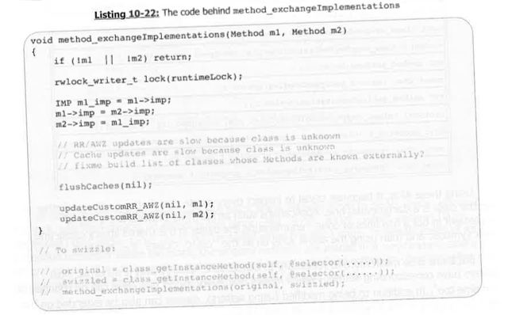
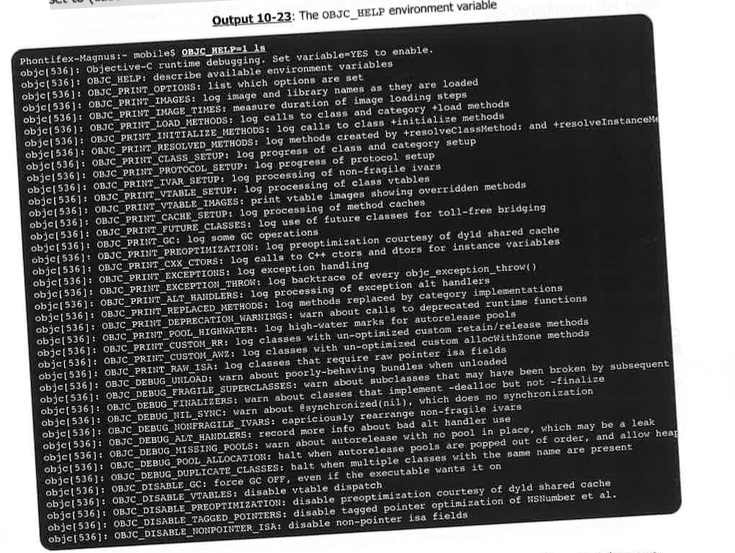
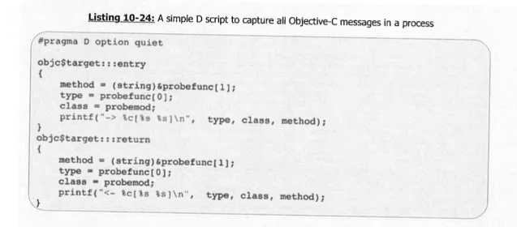
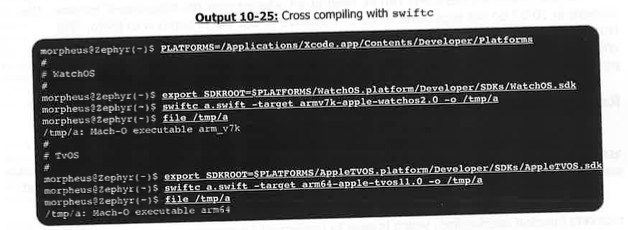
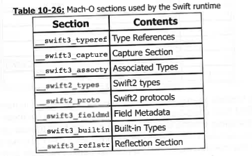
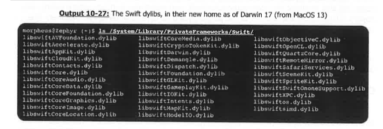
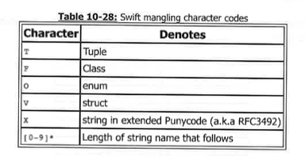
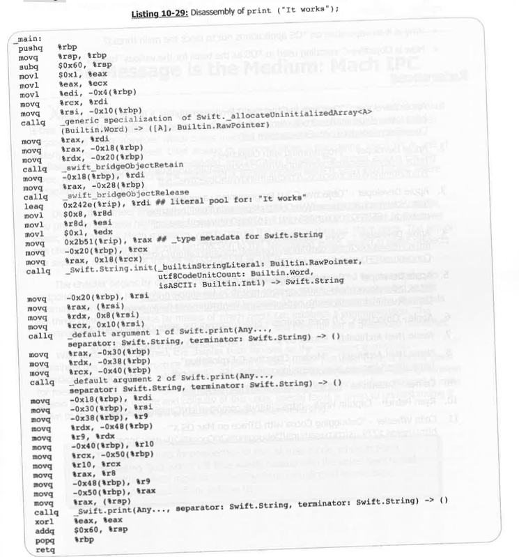

### 原文：Method Swizzling  
One particularly useful aspect of reflection is method swizzling. Swizzling refers to the  
hooking and exchange of a method with another, while allowing the exchanging method to call  
on the exchanged one. It is, in effect, similar to DYLD interposing (Chapter 7), but at a method  
level.  
Swizzling can be performed by obtaining both the exchanging and exchanged method's  
function pointers (`method_getImplementation`), and switching them (by calling  
`method_setImplementation`). Even better, however — the runtime provides a single, atomic  
function to accomplish all this:  
`void method_exchangeImplementations(Method m1, Method m2)`  
This performs the simple pointer switch (between `m1->imp` and `m2->imp`), as well as  
flushing of all the method caches, which effectuates the change on already instantiated  
objects.

### 译文：方法交换（Method Swizzling）  
反射中一个特别有用的方面是方法交换（Method Swizzling）。Swizzling 指的是将一个方法钩住并与另一个方法交换，同时允许交换后的方法仍然可以调用被交换的方法。实际上，这种做法类似于第 7 章提到的 DYLD 函数插桩机制，只不过作用范围缩小到了方法级别。  
Swizzling 的实现方式是先获取目标方法和替换方法的函数指针（使用 `method_getImplementation`），再通过 `method_setImplementation` 进行交换。不过，Objective-C 运行时提供了一个更好且具原子性的方法来完成这一操作：  
`void method_exchangeImplementations(Method m1, Method m2)`  
这个函数会直接交换两个方法的 `imp` 指针（即 `m1->imp` 与 `m2->imp`），并刷新所有方法缓存，从而使得交换对已经实例化的对象立即生效。

### 原文：Swizzling provides vastly powerful capabilities  
Swizzling provides vastly powerful capabilities to modify an existing binary — merely by  
injecting a dylib into it, and performing the swizzling in a constructor. This is exactly what  
CydiaSubstrate does, which provides the basis for the numerous *OS "tweaks" which can be  
found on the Cydia store. Indeed, CydiaSubstrate makes for a wonderful textbook example of  
using Objective-C APIs in practice. Its method swizzling used `method_getImplementation`  
and `method_setImplementation` directly, and has been perfected to a degree that it is  
considered solid and enterprise-grade. Actual proof of that was revealed through the now  
infamous "Pegasus" malware for iOS (discussed in III/22). After compromising the device and  
defeating code signing — needed to install its insidious hooks across multiple applications —  
its designers didn't even bother to implement a custom solution for that — they just used  
CydiaSubstrate directly, not even bothering to obfuscate or hide it.  
Another swizzling library very similar to CydiaSubstrate is Comex's Substrate (Substitute)[9],  
started as a free and open replacement to Cydia but presently unmaintained. For source-level  
swizzling, Ryan Petrich's CaptainHook\* is available[10] as a set of clever `memcpy` operations  
and macros which call the Objective-C runtime `method_[get/set]Implementation` functions.  
\* — An ingenious name, second only to Dino Dai Zovi's "Machiavelli", which is a more generic,  
Mach VM API oriented hooking framework.

### 译文：方法交换的强大能力  
方法交换为修改现有二进制文件提供了极其强大的能力 —— 只需通过注入一个动态库（dylib），并在构造函数中执行方法交换即可。这正是 *CydiaSubstrate* 所做的事情，该工具为 Cydia 商店中众多 *OS 系统的“插件”提供了技术基础。事实上，CydiaSubstrate 是使用 Objective-C API 的绝佳实践范例。它直接使用了 `method_getImplementation` 和 `method_setImplementation` 来实现方法交换，并被打磨得相当完善，已经达到了企业级稳定性的水平。  
这点通过臭名昭著的 iOS 恶意软件“Pegasus”（参见 III/22 章）得到了证实：在攻破设备并绕过代码签名（为了能在多个应用中注入其恶意 hook）之后，Pegasus 的开发者甚至懒得自定义实现方法交换机制，直接使用了 CydiaSubstrate，甚至没有做任何混淆或隐藏处理。  
另一个与 CydiaSubstrate 类似的交换库是 *Comex* 开发的 Substitute（Substrate 的开源替代品）[9]，不过目前已无人维护。对于源码级别的交换，Ryan Petrich 的 *CaptainHook*\* 也可以使用，其实现是一些巧妙的 `memcpy` 操作和宏，底层调用 Objective-C 运行时的 `method_[get/set]Implementation` 函数。  
\* —— 这个名字相当巧妙，仅次于 Dino Dai Zovi 开发的 “Machiavelli”，一个更通用、面向 Mach VM API 的 Hook 框架。

## Tracing Objective-C**  
### 原文 
Recall from Figure 10-8 that **`libobjc.dylib`** checks several **`OBJC_*`** environment variables during the very first stage of initialization. This behavior is similar to that of **`dyld`**.  
The **`OBJC_HELP`** environment variable can be used to print out a complete list of these variables. To enable the functionality of any of them, their values must be set to `"YES"` (case-sensitive). This is demonstrated in **Output 10-23**.

### 译文

**追踪 Objective-C**  
回顾图 10-8，在初始化的最早阶段，**`libobjc.dylib`** 会检查多个 **`OBJC_*`** 环境变量。这一行为与 **`dyld`** 所采用的方式类似。  
通过设置环境变量 **`OBJC_HELP`**，可以输出所有可用环境变量的完整列表。若要启用其中某项功能，必须将其值设置为大小写敏感的 `"YES"`。相关示例如 **输出 10-23** 所示。

### 原文

You might notice that this variable is honored in all programs - even those that have no **Objective-C** dependency (in the above output, **`/bin/ls`** was chosen on purpose to demonstrate this). This is because **`libobjc.dylib`**'s initializer is called implicitly from that of **`libdispatch.dylib`** - which is explicitly called by **`libSystem.B.dylib`** during its own initialization.

### 译文

你可能会注意到这个变量在所有程序中都得到了遵守——即使是那些没有 **Objective-C** 依赖的程序（在上述输出中，特意选择了 **`/bin/ls`** 来演示这一点）。这是因为 **`libobjc.dylib`** 的初始化函数是通过 **`libdispatch.dylib`** 的初始化函数隐式调用的，而 **`libdispatch.dylib`** 又是由 **`libSystem.B.dylib`** 在自身初始化时显式调用的。

## Tracing messages  
### 原文

Setting **NSObjCMessageLoggingEnabled=YES** will log all **Objective-C** messages in the process to a **/tmp/msgSends-pid** file, but will do so without arguments. This can also be done selectively in code (or by force-loading a library) with a call to **instrumentObjcMessageSends (BOOL)**.

### 译文

追踪消息  
设置 **NSObjCMessageLoggingEnabled=YES** 将会把进程中的所有 **Objective-C** 消息记录到 **/tmp/msgSends-pid** 文件中，但不会包含参数。也可以通过在代码中选择性地调用（或强制加载一个库）**instrumentObjcMessageSends (BOOL)** 来实现此功能。

## Using DTrace 
### 原文

The **Objective-C** runtime exports the **obje_runtime** and **obje DTrace** providers. The first is of limited use, as it only provides two probes - **objc_exception_throw** and **_rethrow**. The second, however, is most powerful: When a **PID** is traced, realized classes will provide probes on entry and return of every class method, enabling the tracer to get a complete list of messages. The **D** script in Listing 10-24 can be used to trace all **Objective-C** messages in a target **PID** (specified by **-p**):

### 译文

使用 DTrace  
**Objective-C** 运行时导出了 **obje_runtime** 和 **obje DTrace** 提供程序。第一个用途有限，因为它仅提供两个探针 —— **objc_exception_throw** 和 **_rethrow**。然而，第二个更为强大：当追踪某个 **PID** 时，已实现的类会在每个类方法的入口和返回时提供探针，允许追踪器获取完整的消息列表。列表 10-24 中的 **D** 脚本可用于追踪目标 **PID**（通过 **-p** 指定）中的所有 **Objective-C** 消息。

### 原文

The script can be made far more specific, and - given the selectors and type definitions - can be made to copyin and display more detailed arguments, by constructing probes of the **objc$target : [class[(category)]] : [[+ -]method]: [entry/return]**.  
A detailed (albeit old) guide is Colin Wheeler's "Debugging Cocoa with Trace on **Mac OS X**" [11].

### 译文

该脚本可以变得更加具体，并且——根据选择器和类型定义——可以通过构造 **objc$target : [class[(category)]] : [[+ -]method]: [entry/return]** 的探针，来复制并显示更详细的参数。  
一份详细的（尽管较旧的）指南是 Colin Wheeler 的《在 **Mac OS X** 上调试 Cocoa 使用 Trace》[11]。

### 原文

**Swift** is Apple's newest programming language, as its designated successor to **Objective-C**. Introduced in WWDC 2014, Swift has rapidly grown to overtake **Objective-C** as the language of choice for developing applications, thanks to the simplicity of its syntax and its powerful features.  
Apple has also provided the open sources to **Swift**, and maintains swift.org, where (along with Apple's GitHub page) the sources of the language and its core libraries can be obtained. The open source nature of the language has allowed it to be ported to **Linux** as well.  
The **Swift** open sources include ample documentation on the inner workings of the compiler and the runtime, in **rst** (restructured text). Both are therefore kept out of scope of this discussion, which instead focuses on a reverse engineering perspective.

### 译文

**Swift** 是苹果推出的最新编程语言，作为 **Objective-C** 的指定继任者。它在 2014 年的 **WWDC** 上首次发布，并凭借简洁的语法和强大的功能迅速超越了 **Objective-C**，成为开发应用程序的首选语言。  
苹果还将 **Swift** 开源，并维护着 swift.org 网站，在那里（以及苹果的 GitHub 页面）可以获取语言及其核心库的源代码。语言的开源特性也使得 **Swift** 可以被移植到 **Linux** 上。  
**Swift** 的开源项目包含了大量关于编译器和运行时内部工作原理的文档，使用 **rst**（重构文本）格式。因此，本文不涉及这些内容，重点是从逆向工程的角度进行探讨。

## **Compiling**  
### 原文

**Swift** is one of a few programming languages that are designed to be suitable both for interpreters as well as compilers. The **iOS Playgrounds.app** contains a built-in interpreter which supports its powerful abilities. In **MacOS**, Apple provides **swift** and **swifte** as the interpreter and compiler binaries. The compiler is normally set to emit **MacOS (x86_64)** code, but can easily be set to target different architectures using `-target` and setting `SDKROOT` appropriately.  
**Output 10-25** shows the settings for cross compiling:

### 译文

**编译**  
**Swift** 是为解释器和编译器都能适用的少数编程语言之一。**iOS Playgrounds.app** 包含一个内建的解释器，支持其强大的功能。在 **MacOS** 上，苹果提供了 **swift** 和 **swifte** 作为解释器和编译器的二进制文件。编译器通常设置为生成 **MacOS (x86_64)** 代码，但可以通过使用 `-target` 并适当设置 `SDKROOT` 来轻松地将目标架构切换为其他架构。  
**Output 10-25** 显示了交叉编译的设置：

### 原文

**Mach-O Sections**  
The **Swift** runtime, similar to that of **Objective-C**, makes use of "well known" **Mach-O** sections to store its data. Another indicator of **swift** binaries is the numerous **Mach-O load commands** required to satisfy the runtime dependencies. All binaries must link with **libswiftCore.dylib**, and the vast majority of them also link with **libswiftDispatch.dylib (GCD)**, **libswift[Core]Foundation.dylib**, **libswiftDarwin.dylib**, and **libswiftObjectiveC.dylib**, all of which serve as bridges to the underlying frameworks.

### 译文

**Mach-O 区段**  
**Swift** 运行时与 **Objective-C** 类似，使用“知名的” **Mach-O** 区段来存储其数据。另一个 **swift** 二进制文件的指示器是需要满足运行时依赖的众多 **Mach-O 加载命令**。所有二进制文件必须链接 **libswiftCore.dylib**，而绝大多数二进制文件还链接 **libswiftDispatch.dylib (GCD)**、**libswift[Core]Foundation.dylib**、**libswiftDarwin.dylib** 和 **libswiftObjectiveC.dylib**，这些都作为桥梁连接到底层框架。

### 原文

Up until **Darwin 17**, applications were expected to package the numerous bridge **dylibs** with them, due to the "DLL-hell" of different **Swift** versions. Most applications still do so, using the **IC_RPATH** load command to define their private library path, and load the **dylibs** via **erpath** bases. As of **Darwin 17**, the `/System/Library/PrivateFrameworks/Swift/` contains all the libraries, as shown in Output 10-27.

### 译文

直到 **Darwin 17**，应用程序都需要将众多桥接 **dylibs** 打包在一起，这是由于不同 **Swift** 版本导致的“DLL 地狱”问题。大多数应用程序仍然这样做，使用 **IC_RPATH** 加载命令定义它们的私有库路径，并通过 **erpath** 基址加载 **dylibs**。从 **Darwin 17** 开始，`/System/Library/PrivateFrameworks/Swift/` 包含所有这些库，如输出 10-27 所示。

### 原文

The runtime libraries in *OS are all prelinked into the shared library cache (as of **iOS 11** and its counterparts). These vary slightly in makeup (e.g. **iOS 11**'s contains **libswiftARKit.dylib** and **libswiftHomeKit.dylib**).
The **Swift** runtime, therefore, can be seen as an adapter over the **Objective-C** runtime. The sections in 10-27 do not supersede those of **Objective-C**, but are in addition to them. This becomes even clearer when one inspects the implementation of **Swift** objects: These are, in effect, special cases of **Objective-C** objects. Whereas all **Objective-C** objects derive from **NSObject**, **Swift** objects derive from **libswiftCore**'s **Swiftobject**.

### 译文

在 **iOS 11** 及其对应系统版本中，**iOS** 中的运行时库都已预先链接到共享库缓存中。这些库在组成上略有不同（例如，**iOS 11** 包含 **libswiftARKit.dylib** 和 **libswiftHomeKit.dylib**）。
因此，**Swift** 运行时可以看作是 **Objective-C** 运行时的一个适配器。10-27 中的部分并不取代 **Objective-C** 的部分，而是对其的补充。更清楚的理解可以通过检查 **Swift** 对象的实现来获得：这些对象实际上是 **Objective-C** 对象的特例。所有 **Objective-C** 对象都继承自 **NSObject**，而 **Swift** 对象则继承自 **libswiftCore** 的 **Swiftobject**。

### 原文

Reverse engineering **Swift** binaries  
It is somewhat ironic, that **Objective-C** is often perceived as having terrible syntax, yet its assembly is considered easy and almost elegant. **Swift**'s syntax and grammar, on the other hand, are simple and almost natural language, but the generated assembly is woefully difficult to read. A major contributing factor to assembly unreadability is **Swift**'s name mangling. **Swift** supports function overloading, which is easy to implement by encoding arguments and datatypes into the function's linked name.

### 译文

逆向工程 **Swift** 二进制文件  
有些讽刺的是，**Objective-C** 经常被认为语法糟糕，但它的汇编代码被认为易于理解，甚至几乎优雅。另一方面，**Swift** 的语法和语法结构简单且接近自然语言，但生成的汇编代码却极其难以阅读。导致汇编代码难以理解的一个主要因素是 **Swift** 的名称重整（name mangling）。**Swift** 支持函数重载，通过将参数和数据类型编码进函数的链接名称中，这使得函数重载的实现变得简单。

### 原文

**Swift** supports Unicode for names, and so the embedded strings in mangled names need to account for non-ASCII type characters as well. The encoding used for these is "Punycode" (a.k.a RFC3492). **Swift**'s mangling scheme is particularly long, and hard to read unaided. Fortunately, `swift-demangle` (in `codeDefault.xctoolchain/usr/bin`) provides a C++ filter-like demangler, which can be used to convert the mangled names into a (barely) human-readable form.

### 译文

**Swift** 支持 Unicode 字符作为名称，因此在重整名称中的嵌入字符串需要考虑非 ASCII 类型的字符。用于这些字符的编码是 "Punycode"（即 RFC3492）。**Swift** 的名称重整方案特别冗长，并且没有辅助工具很难阅读。幸运的是，`swift-demangle`（位于 `codeDefault.xctoolchain/usr/bin`）提供了类似 C++ 的解重整器，可以将重整后的名称转换为一种（勉强）可读的形式。

### 原文

Reverse engineering **Swift** code isn't as simple as **Objective-C**, owing to **Swift**'s many runtime calls. A simple one-liner (`print("It works\n")`) does become a call to `Swift.print(...)`, but not before undergoing runtime object construction of strings, and setting up default arguments. Listing 10-29 shows the output of `otool -tv` and `swift-demangle`:

### 译文

逆向工程 **Swift** 代码并不像 **Objective-C** 那样简单，因为 **Swift** 存在许多运行时调用。一个简单的一行代码 (`print("It works\n")`) 确实会变成对 `Swift.print(...)` 的调用，但在此之前会经历字符串的运行时对象构造，并设置默认参数。列表 10-29 显示了 `otool -tv` 和 `swift-demangle` 的输出：

### Review Questions  
- What are the advantages provided by using CoreFoundation objects, rather than the direct underlying primitives?  
- How is a CFRunLoop different than a Windows message loop or Android Looper construct?  
- What are the _var_folders_ references in Listing 10-16?  
- Why is it so imperative on *OS applications not to block the main thread?  
- How is Objective-C swizzling used in *OS as the basis for the various "tweaks"?

### 译文：复习问题  
- 相较于直接使用底层原始类型，使用 CoreFoundation 对象有哪些优势？  
- CFRunLoop 与 Windows 的消息循环或 Android 的 Looper 构造有何不同？  
- Listing 10-16 中的 `_var_folders_` 引用是什么？  
- 为什么在 *OS 应用中，不能阻塞主线程如此重要？  
- Objective-C 方法交换（swizzling）是如何作为 *OS 中各种 “tweak” 的基础机制的？

References
1. Apple Developer - "Concepts in Objective C Programming" -
https://developer.apple.com/library/ios/documentation/General/Conceptual/ CocoaEncyclopedia/CocoaEncyclopedia.pdf
2. Apple Developer - "Programming with Objective C" -
https://developer.apple.com/library/mac/documentation/Cocoa/Conceptual/
ProgrammingWithObjectiveC/ProgrammingWithObjectiveC.pdf
3. Apple Developer - "Objective C 2.0 Programming Language" -
http://deimos3.apple.com/WebObjects/Core.woa/FeedEnclosure/
utah.edu.1668842900.01668842919.1679650489/enclosure.pdf
4. Apple Developer - "Core Foundation Design Concepts" -
https://developer.apple.com/library/content/documentation/CoreFoundation/
Conceptual/CFDesignConcepts/CFDesignConcepts.html
5. Apple Developer - "Threading Programming Guide" -
https://developer.apple.com/library/content/documentation/Cocoa/
Conceptual/Multithreading/RunLoopManagement/RunLoopManagement.html
6. Apple - Objective C 2.0 open sources - http://opensource.apple.com/tarballs/objc4/
7. Nemo (Neil Archibald) - Phrack 69-9 - http://www.phrack.org/issues/69/9.html
8. Nemo (Neil Archibald) - "Modern Objective-C Exploitation" -
https://thecyberwire.com/events/docs/Nemo_JSS_Slides.pdf
9. Comex - Substitute - https://github.com/comex/substitute
10. Ryan Petrich - Captain Hook - https://github.com/rpetrich/CaptainHook/wiki
11. Colin Wheeler - "Debugging Cocoa with DTrace on Mac OS X" -
http://www.1729.us/cocoasamurai/Debugging%20Cocoa%20with%20DTrace.pdf