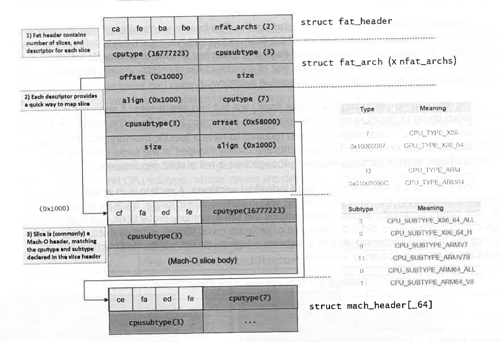
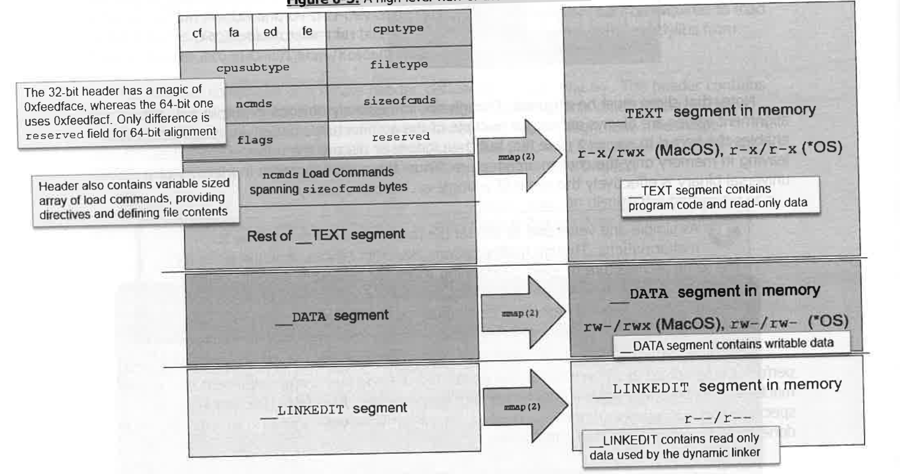
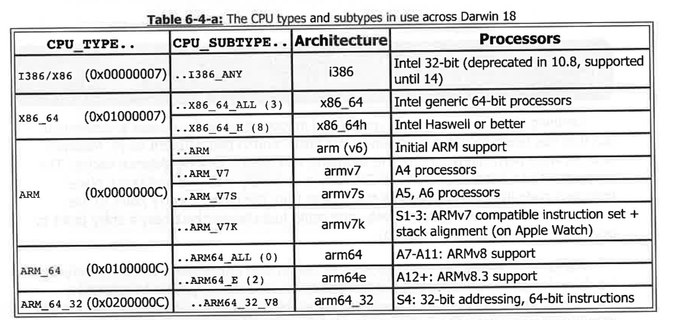

## 6. Ex Machina: The Binary Format

### 原文
Every operating system has a "pet" binary format: Windows' Portable Executable (PE)  
defines its .exe, dll and sys files. Linux (and other UN*X) uses the Executable and Library  
Format (ELF) to define its binaries, so and .ko. In Darwin, the format used is called Mach-O, a  
tribute to the Mach microkernel, for which it was developed.  
Though as venerable as its NeXTSTEP origin, Apple shows no desire of letting it go. Quite  
the contrary - Since Apple took over, it has extended and expanded the format, to allow for new  
and emerging needs, such as 64-bit support, code signing, code encryption and more.  
The Apple Developer "Mach-O Programming Topics"[1] provides a good, though somewhat  
outdated reference. Another guide, "Mach-O File Format Reference" [2] is no longer maintained  
by Apple. It is the aim of this chapter to provide comprehensive detail for this important format,  
which will stay the one and only binary format in Darwin flavors for years to come.

### 翻译
每个操作系统都有一个“专用”的二进制格式：Windows 的可执行文件格式（Portable Executable，PE）定义了其 .exe、.dll 和 .sys 文件；  
Linux（以及其他 UNIX 系统）使用可执行和库格式（Executable and Library Format，ELF）来定义其二进制文件，如 .so 和 .ko。  
在 Darwin 中，使用的格式被称为 Mach-O，它是为了 Mach 微内核而开发的，名字也致敬于 Mach 微内核。  
尽管它和 NeXTSTEP 的起源一样历史悠久，但苹果公司并没有放弃它。恰恰相反，自从苹果接管后，它一直在扩展和改进这个格式，以支持新兴的需求，比如 64 位支持、代码签名、代码加密等等。  
苹果开发者的《Mach-O 编程主题》[1] 提供了一个不错的参考，尽管有些过时。另一个指南《Mach-O 文件格式参考》[2] 已不再由苹果维护。  
本章旨在详细介绍这一重要格式，预计它将在未来多年内继续是 Darwin 系列操作系统中唯一的二进制格式。

---
### 原文
This chapter focuses on the Mach-O format, as created by the linker  
component of the compiler toolchain, which is referred to as ld (1). The  
Mach-O objects, however, are seldom standalone, and therefore require further  
linking at loadtime and throughout the process runtime, which is performed by  
/usr/lib/dyld. The latter is called the dynamic linker (or link editor), and is  
referred to as dyld (1).

### 翻译
本章聚焦于 Mach-O 格式，这是由编译器工具链中的链接器组件创建的，通常称为 ld (1)。  
然而，Mach-O 对象很少是独立存在的，因此在加载时和整个进程运行时，需要进一步的链接操作，这些操作由 `/usr/lib/dyld` 执行。  
后者被称为动态链接器（或链接编辑器），通常称为 dyld (1)。

## Overture: Fat Binaries (pre-iOS 11 and macOS 15)
序幕：Fat 二进制文件（iOS 11 之前和 macOS 15 之前）

### 原文
When Apple adopted Darwin, the platform of choice was PowerPC. By MacOS 10.4,  
however, Apple has decided to transition to the Intel architecture. This posed a challenge: How  
does one get a PowerPC binary to run on an Intel architecture, or vice versa, when the two are  
incompatible at the machine level?  
The approach adopted by Apple to deal with this was the introduction of Universal  
Binaries. Despite the catchy name implying the ability of a binary to execute anywhere and  
everywhere, however, the idea was far simpler: Package multiple versions of the actual binary -  
one per each architecture - side by side, into the bigger, so-called "universal" binary. It's no  
wonder, then, that the informal - less catchy, but more accurate name for this type of binaries is  
"fat" binaries, as they were known in NeXTSTEP. Indeed, these binaries end up bloated, as  
multiple versions of the same binary end up doubling or tripling the file size.  
Nonetheless, universal binaries greatly facilitate handling multiple versions of the same  
binary. Even in modern days, when PPC is no more, you can still find universal binary versions of  
most libraries and frameworks in MacOS, as well as most third party iOS applications. In MacOS  
the binaries hold 32-bit (i386) legacy versions next to the standard 64-bit (x86_64) ones, and (in  
some cases) 64-bit Haswell (x86_64h). Fat binaries are similarly used in some cases for 64-bit  
iOS (armv7 next to armv8) (up to iOS 10), but not TvOS or as of iOS 11 (which only supports  
armv8), or WatchOS (armv7k or the new arm64_32 in Series 4). The binary loader, /usr/lib/dyld  
is fat as well on MacOS and 64-bit i-Devices (before iOS 11) because it may be required to load  
32-bit binaries. Xcode also creates fat binaries when extracting frameworks and dylibs from  
these i-Devices into $HOME/Library/code/Developer/iOS DeviceSupport/Symbols.  
Fat files are comprised of a simple header, defined in <mach-o/fat.h>. The header contains  
the magic value, and defines the number of architecture specifications which follow. Each  
architecture the matching CPU type and subtype, an offset and an alignment. The magic  
(Oxcafebabe) inadvertently collides with that of Java .class files, and may appear in either big-  
endian or little-endian (Oxbebafeca) form, depending on architecture bitness.  
Using otool or jtool (j) - either with the -f switch - you can display the fat header of a  
given universal binary, as shown in Output 6-1, and Figure 6-2 (next page) which visualizes it:

### 翻译
当苹果采用 Darwin 时，选择的平台是 PowerPC。然而到 macOS 10.4 时，  
苹果决定转向 Intel 架构。这提出了一个挑战：当两者在机器级别不兼容时，如何让 PowerPC 二进制文件在 Intel 架构上运行，或者反之？  
苹果为了解决这个问题，引入了通用二进制文件。尽管这个名字让人联想到二进制文件可以在任何地方执行，  
但实际的思想要简单得多：将多个版本的实际二进制文件——每个架构一个——并排打包成一个更大的、所谓的“通用”二进制文件。  
因此，这种类型的二进制文件在 NeXTSTEP 中被称为“fat”二进制文件，这个名称也就不足为奇了。事实上，这些二进制文件最终变得臃肿，  
因为相同二进制文件的多个版本最终导致文件大小加倍或三倍。  
尽管如此，通用二进制文件极大地方便了处理同一二进制文件的多个版本。即使在现代，尽管 PowerPC 不再使用，你仍然可以在  
macOS 中找到大多数库和框架的通用二进制版本，以及大多数第三方 iOS 应用程序。在 macOS 中，  
这些二进制文件包含 32 位（i386）遗留版本，并与标准的 64 位（x86_64）版本并排存放，在某些情况下还包括 64 位 Haswell（x86_64h）版本。  
在某些情况下，fat 二进制文件也用于 64 位 iOS（armv7 和 armv8 并存）（直到 iOS 10），但不适用于 tvOS 或 iOS 11 之后的版本（仅支持 armv8），  
以及 WatchOS（armv7k 或 Series 4 中新的 arm64_32）。二进制加载器 `/usr/lib/dyld` 在 macOS 和 64 位 iDevice 上（iOS 11 之前）也采用 fat 格式，  
因为它可能需要加载 32 位二进制文件。Xcode 在从这些 i-Devices 提取框架和 dylibs 到 `$HOME/Library/code/Developer/iOS DeviceSupport/Symbols` 时，也会创建 fat 二进制文件。  
fat 文件由一个简单的头部组成，头部在 `<mach-o/fat.h>` 中定义。头部包含魔法值，并定义接下来的架构规格的数量。  
每个架构对应的 CPU 类型和子类型、偏移量和对齐方式。魔法值（Oxcafebabe）不小心与 Java 的 .class 文件的魔法值冲突，  
并且可能以大端（Oxcafebabe）或小端（Oxbebafeca）形式出现，具体取决于架构的字节顺序。  
使用 `otool` 或 `jtool`（带 -f 选项），你可以显示给定通用二进制文件的 fat 头部，正如输出 6-1 所示，并且图 6-2（下一页）将其可视化：

---
### Output 6-1: Demonstrating fat binaries with file(1) and jtool (j)

### Figure 6-2: Visualizing the fat binary shown in the previous output

### 原文
Note, that slices must be aligned. Though not immediately obvious in output 6-1, the  
alignment values are always an integer multiple of the architecture's underlying page size, which  
enables the kernel to mmap (2) the file, but then ignore or discard the unnecessary slices,  
leaving in memory only the chosen architecture. Thus, the overall footprint in memory of a  
universal binary is effectively the same of a single-architecture binary.

### 翻译
请注意，切片必须对齐。尽管在输出 6-1 中不太明显，  
但对齐值总是架构底层页面大小的整数倍，这使得内核能够通过 mmap (2) 映射文件，  
然后忽略或丢弃不必要的切片，只将所选架构保留在内存中。  
因此，通用二进制文件在内存中的总体占用实际上与单一架构的二进制文件相同。

#### 原文
>As simple and venerable as the fat file format is, it is not immune to  
malformations. Though malformations like empty slices, multiple slices for  
the same architecture or even overlapping slices are obviously "illegal", neither  
MacOS nor iOS performed any significant validations on fat files - which enabled  
TaiG to bypass codesigning in iOS versions up to 8.4.1.

#### 翻译
>尽管 fat 文件格式简单且历史悠久，但它并非不受损坏的影响。  
虽然像空切片、同一架构的多个切片，甚至重叠切片这样的损坏显然是“非法”的，  
但 MacOS 和 iOS 都没有对 fat 文件进行任何重大验证——这使得 TaiG 能够绕过  
iOS 8.4.1 之前版本的代码签名。

### 原文
When a fat binary is loaded, the kernel recognizes the `FAT_MAGIC` (or `FAT_CIGAM`) and performs a "grading" of its architecture slices, to find the one most compatible with the machine.  
This is usually done automatically but may be overridden from user mode by specifying `posix_spawnattr_setbinpref_np(3)` prior to calling `posix_spawn(2)`, as is done by the `arch(1)` command line utility.  
The `NX*` APIs in `<mach-o/arch.h>` can be used to programmatically deduce the best architectural fit for a given binary, as well as manipulate the `NArchInfo` structures.  
However, the need to do so nowadays is fairly rare, since macOS natively supports `x86_64` and iOS is moving to `armv8`.  
A command line utility `lipo(1)` — named with some humor — can be used to extract slices or create binaries.  
`jtool(j)` can also perform extraction (using `-e arch`) or transparently work on specific slices when `-arch` or `ARCH=` are specified.  
The latter form (using the environment variable) is useful to set a default architecture.

iOS 11 marks Apple’s final (and long overdue) departure from the 32-bit iOS world, so there is no more need for fat binaries on 64-bit devices.  
macOS still contains 32-bit slices in most frameworks (but not in those introduced after 10.10), and in `/usr/lib/dyld`.  
However, when macOS completely abandons 32-bit support in macOS 15, fat binaries will become obsolete — except for binaries targeting multiple architectures (like this author's tools) and linker libraries.  
Fat or thin, however, all paths lead to the one and only binary format Darwin supports: Mach-O.

### 翻译
当加载一个 fat 二进制文件时，内核会识别 `FAT_MAGIC`（或 `FAT_CIGAM`），并对其架构切片进行“评估”，以找到与当前机器架构最兼容的那一个。  
通常这个过程是自动完成的，但也可以通过在调用 `posix_spawn(2)` 之前指定 `posix_spawnattr_setbinpref_np(3)` 来从用户态覆盖，正如 `arch(1)` 命令行工具所做的那样。  
在 `<mach-o/arch.h>` 中提供的 `NX*` API 可用于以编程方式推断出最适合某个二进制文件的架构，并操作 `NArchInfo` 结构。  
不过，现如今这么做的需求已经很少了，因为 macOS 原生支持 `x86_64` 架构，而 iOS 也在转向 `armv8`。

命令行工具 `lipo(1)` —— 这个名字带着一点幽默感 —— 可以用来提取切片或创建新的二进制文件。  
`jtool(j)` 也可以执行提取操作（使用 `-e arch` 参数），或者在指定 `-arch` 或环境变量 `ARCH=` 时透明地作用于特定切片。  
后者（使用环境变量的方式）适合用于设置默认的架构。

iOS 11 标志着苹果最终（而且早该完成的）退出 32 位 iOS 世界，因此在 64 位设备上不再需要 fat 二进制文件。  
macOS 仍然在大多数框架（但不包括 10.10 之后新增的框架）以及 `/usr/lib/dyld` 中保留了 32 位切片。  
不过，当 macOS 在 macOS 15 完全放弃对 32 位支持时，fat 二进制文件将会彻底过时，除了仍需支持多架构的二进制（比如本书作者的一些工具）和链接库之外。  
无论是 fat 还是 thin，所有路径最终都会通向 Darwin 支持的唯一二进制格式 —— Mach-O。

## Mach- Concepts

### 原文
A Mach-O object begins with a fixed-size header.  
The header starts with a magic value (commonly `0xfeedface` for 32-bit little-endian binaries, or `0xfeedfacf` for 64-bit little-endian binaries), defines the object type, the target architecture, some flags, and a number of load commands that follow.  
The load commands describe the rest of the object file contents, usually (but not necessarily) in ascending order of appearance in memory.

The file contents (including the header itself) are organized into segments.  
A segment is a contiguous group of pages in virtual memory, which are `mmap(2)`-ed from the object file during the loading process.  
Each segment is also required to have a specific memory protection, as indicated in its load command.  
Segments are usually mapped in the same ordering and relative offsets as their file page locations, though that is not a strict requirement.

Segments may further be divided into individual sections.  
A section is effectively a sub-mapping, taken from the same file mapping and within the same address range.  
Because they are part of their parent segments, sections must employ the same memory protections.  
However, sections commonly contain distinct content (e.g., program code, strings, symbol stubs, etc.), which justifies their artificial separation.

Figure 6-3 shows a high-level view of the file structure and its mapping to memory (omitting section details).

**Figure 6-3: A high-level view of the Mach-O format**

---

### 翻译
一个 Mach-O 对象以固定大小的头部开始。  
头部以一个魔法数（通常是 32 位小端格式的 `0xfeedface`，或 64 位小端格式的 `0xfeedfacf`）开头，  
并定义了对象类型、目标架构、一些标志位，以及后续的一系列加载命令（load commands）。  
这些加载命令描述了对象文件的其余内容，通常（但不一定）按照它们在内存中出现的顺序排列。

文件的内容（包括头部本身）被组织到段（segment）中。  
段是虚拟内存中的一组连续页面，在加载过程中通过 `mmap(2)` 从对象文件中映射而来。  
每个段还必须在其加载命令中指定特定的内存保护属性。  
通常，段在内存中的映射顺序和偏移量与文件中页面的位置相同，  
但这并不是一个严格的要求。

段内部还可以进一步划分为各个节（section）。  
节实际上是从同一文件映射中提取的一小块子映射，位于同一地址范围内。  
由于节是隶属于其父段的，因此它们必须使用相同的内存保护属性。  
不过，节通常包含一些特定的内容（例如程序代码、字符串、符号桩等），这就促成了对它们的人工划分。

**图 6-3 展示了 Mach-O 格式的文件结构及其到内存的映射（忽略了节的细节）。**

**图 6-3：Mach-O 格式的高级视图**
### 原文
You can examine the layout of a Mach-O object using `otool(1)` or `jtool(j)`, as shown in numerous examples throughout this chapter.  
`jtool(j)` matches or improves upon most of `otool(1)`'s functions, and is also used in place of Apple's other utilities, as those require the Xcode CLI tools to be installed and are not available for the *OS variants.  
The following table provides a mapping of those tools and their `jtool(j)` equivalent switches.

**Table 6-4: Mapping the Apple built-in tools to their jtool(j) equivalents**

> *Readers familiar with the Executable Linkable Format (ELF) used on Linux and other UN*X systems should note that the term "segment" is used differently — an ELF segment is more similar to a Mach-O section.*

| Apple 工具 | jtool 等效参数 | 功能描述 |
| :-------- | :------------- | :------- |
| pagestuff -a | --pages | Mach-O 文件页面分析工具 |
| size -m     | --pages  | 打印对象文件中各节（section）的大小 |
| segedit ...   | -e, -r, -i     | 提取、替换对象文件中的节（section） |
| nm [-m] | -S [-v] | 显示符号表（name list） |
| dyldinfo    | （同样的开关） | 显示可执行文件中 dyld 使用的信息 |

---

### 翻译
你可以使用 `otool(1)` 或 `jtool(j)` 来查看 Mach-O 对象的布局，本章后续的多个示例中都有展示。  
`jtool(j)` 在大多数功能上与 `otool(1)` 相匹配，甚至有所改进，并且还能代替苹果的其他一些工具，  
因为苹果官方工具通常需要安装 Xcode 命令行工具（CLI Tools），而且这些工具在 *OS 变体上不可用。

下表列出了苹果内建工具及其在 `jtool(j)` 中的等效参数对应关系。

> *熟悉 Linux 及其他 UNIX 系统中可执行可链接格式（ELF）的读者应注意，术语“segment”的含义有所不同 —— ELF 中的 segment 更接近 Mach-O 中的 section。*

>jtool 在最新系统版本中已经不可用了。使用 otool 替代
The 4.4.0 release notes are available on the Homebrew Blog:
  https://brew.sh/blog/4.4.0
The 4.4.32 changelog can be found at:
  https://github.com/Homebrew/brew/releases/tag/4.4.32
Error: Cask 'jtool' has been disabled because it is discontinued upstream! It was disabled on 2024-12-16.

### 原文
## Architectures

Mach-O was designed to support multiple architectures.  
Back in the days of NeXTSTEP, the OS could run on several architectures, including PowerPC, i386 (Intel 32-bit), and Motorola 68k.  
There was also theoretical support for quite a few other architectures, including Sun's SPARC, DEC's Alpha, and even VAX (I know, right?).  
Most of these architectures are now obsolete, but Apple continued the trend and extended support to more architectures.  

First came PowerPC64, which was briefly supported in macOS 10.5 along with x86_64.  
All but the Intel architectures (i386 and x86_64) eventually disappeared.  
Later, with the introduction of iOS, came the move to ARM — but even within those two architecture families, there are numerous variants to consider.

The Mach-O header specifies its target architecture, much like the fat header, with two fields:  
CPU Type and CPU Subtype, whose values are defined in `<mach/machine.h>`.  
Currently, the only CPU types supported are `CPU_TYPE_X86[_64]` and `CPU_TYPE_ARM[_64]`,  
where 64-bit variants are indicated by OR-ing with `CPU_ARCH_ABI64` (0x01000000).  
There are, however, quite a few subtypes, which are shown in **Table 6-4-a**.

---

### 翻译
## 架构（Architectures）

Mach-O 被设计为支持多种不同的处理器架构。  
在 NeXTSTEP 时代，操作系统可以运行在多种平台上，包括 PowerPC、i386（Intel 32 位）和 Motorola 68k。  
理论上还支持不少其他架构，比如 Sun 的 SPARC、DEC 的 Alpha，甚至是 VAX（没错，VAX！）。  
不过，这些架构大多数如今已经被淘汰，但苹果延续了支持多架构的传统，并进一步扩展了对新架构的支持。

最先扩展的是 PowerPC64，它在 macOS 10.5 中曾短暂地与 x86_64 一起被支持。  
随着时间推移，除了 Intel 架构（i386 和 x86_64）之外的其他架构基本都逐渐被废弃。  
后来随着 iOS 的推出，苹果又转向了 ARM 架构——不过即便在这两个大家族内部，也有诸多不同的子架构需要考虑。

Mach-O 文件头会指定目标架构，这一点与 fat 文件头类似，  
通过两个字段来表示：CPU 类型（CPU Type）和 CPU 子类型（CPU Subtype）。  
这些取值在 `<mach/machine.h>` 文件中定义。  
当前，Mach-O 仅支持两种 CPU 类型：`CPU_TYPE_X86[_64]` 和 `CPU_TYPE_ARM[_64]`。  
其中，64 位变种通过与 `CPU_ARCH_ABI64`（0x01000000）进行按位或（OR）操作来表示。  
不过，实际存在不少不同的子类型，它们将在 **表 6-4-a** 中列出。

### 原文
## Endianness

There's one more minor issue: platform endianness — the direction in which bits are read, from least significant to most significant.  
Originally, most architectures used "network byte order," which is Big Endian (`0x12345678`).  
However, Intel and ARM architectures adopted Little Endian ordering (`0x78563412`), though ARM Big Endian implementations do exist.

In order to differentiate between similar architectures with different endianness, the Mach-O header's magic value is encoded differently:  
- On little-endian architectures, it uses `MH_MAGIC[_64]` (`0xcefaedfe` or `0xcffaedfe`).
- On big-endian architectures, it uses `MH_CIGAM[_64]` (`0xfeedface` or `0xfeedfacf`).

Keep this in mind when examining hex dumps — the magic value will appear differently when dumping four bytes at a time versus dumping byte by byte.

---

### 翻译
## 字节序（Endianness）

还有一个细节问题需要注意：平台的字节序（即读取比特位的方向，从最低有效位到最高有效位）。  
最初，大多数架构使用所谓的“网络字节序”，也就是大端（Big Endian，`0x12345678`）。  
然而，Intel 和 ARM 架构采用了小端（Little Endian，`0x78563412`）的排列方式，  
不过 ARM 也存在大端模式的实现。

为了区分具有不同字节序的相似架构，Mach-O 文件头的魔法数（magic value）编码方式也有所不同：  
- 在小端架构上，使用的是 `MH_MAGIC[_64]`（`0xcefaedfe` 或 `0xcffaedfe`）。
- 在大端架构上，使用的是 `MH_CIGAM[_64]`（`0xfeedface` 或 `0xfeedfacf`）。

在查看十六进制转储（hex dump）时要牢记这一点 —— 当一次转储四个字节与逐字节转储时，  
魔法数的显示顺序会有所不同。

