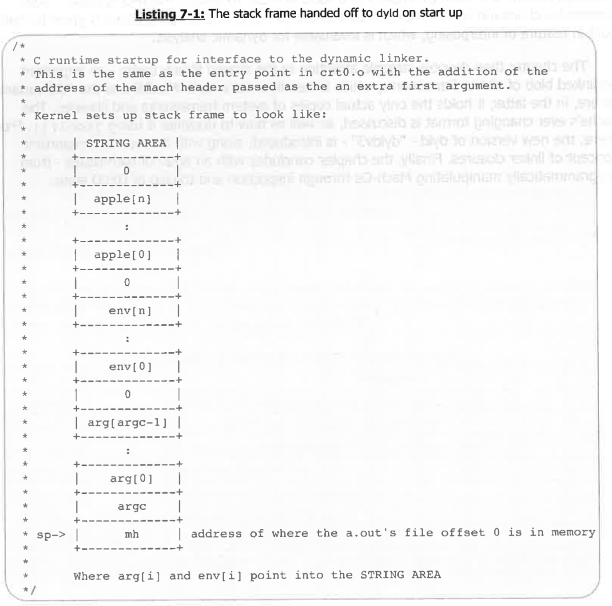
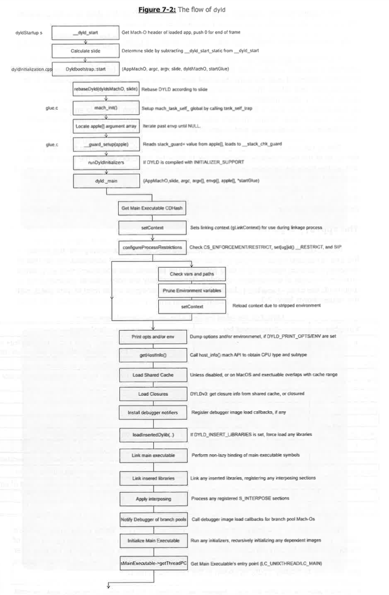
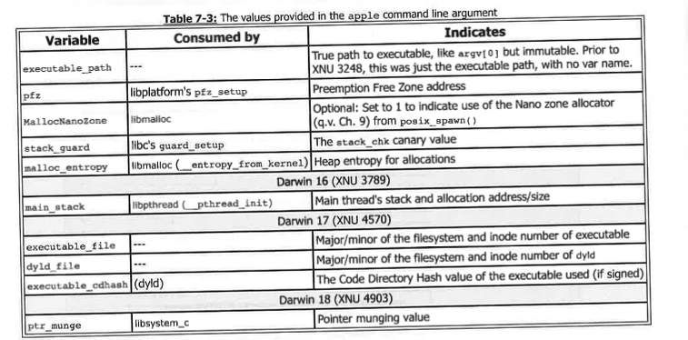
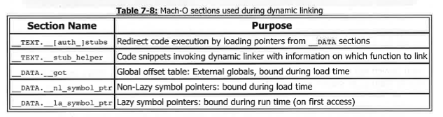
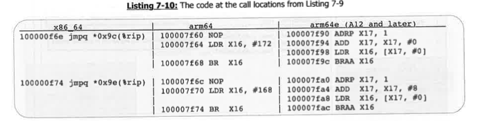
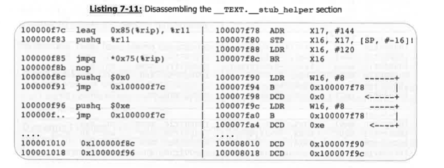
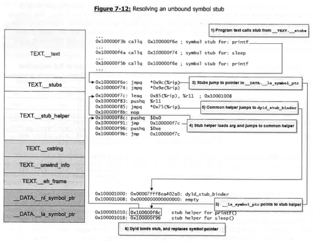
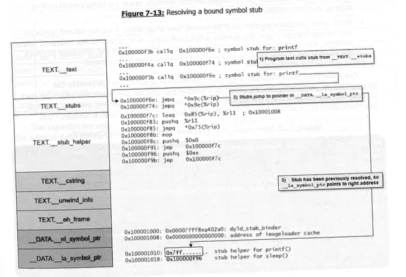

### 原文
## In the Darkness, Bind Them: dyld Internals

A well-designed file format is only one part of the puzzle of loading and executing a binary.  
It takes a dynamic linker to resolve load-time and run-time dependencies, piece together the necessary components, lay them out in memory, and bind (or link) them together.

As with their specialized binary format, Darwin systems also use a specialized dynamic linker — `/usr/lib/dyld` — to accomplish these goals.  
Although it is open source, there is virtually no documentation outside of Apple (and the book's companion website) on the linker's inner workings.  
This chapter brings the linker into the limelight, starting with an explanation of its general flow, and then focusing on how it performs the linking and binding of symbols.

The chapter also introduces one of Apple's most useful frameworks — CoreSymbolication.  
Although private, it is used by Apple's own tools to resolve Mach-O symbols — both exported and unexported — making it highly useful for reverse engineers.  
Particular focus is given to dyld’s built-in feature of interposing, which is invaluable for dynamic analysis.

The chapter then devotes considerable attention to the shared library cache — an important prelinked blob of all frameworks, heavily used in both macOS and the *OS variants.  
In the latter, the cache holds the only actual copies of system frameworks and libraries.  
The cache's ever-changing format is discussed, along with how to decipher it using `jtool(j)`.

From there, the new version of dyld — "dyld v3" — is introduced, along with the important new concept of linker closures.  
Finally, the chapter concludes with an array of techniques for programmatically manipulating Mach-Os and inspecting and tracing the DYLD state.

---

### 翻译
## 黑暗中绑定它们：dyld 内部机制

一个设计良好的文件格式只是加载和执行二进制文件这张拼图中的一部分。  
要解决加载时和运行时的依赖关系，拼接必要的组件，将它们布局到内存中并进行绑定（或链接），还需要一个动态链接器。

就像 Darwin 系统采用了专用的二进制文件格式一样，它们也使用了一个专门的动态链接器——`/usr/lib/dyld`——来实现这些目标。  
尽管 dyld 是开源的，但除了苹果公司内部（以及本书配套网站）外，几乎没有关于其内部工作机制的文档。  
本章将 dyld 带入聚光灯下，首先介绍其整体流程，然后重点讲解它是如何执行符号链接与绑定的。

本章还介绍了苹果最有用的私有框架之一 —— CoreSymbolication。  
虽然这是一个私有框架，但苹果自己的工具也使用它来解析 Mach-O 符号（无论是已导出还是未导出的符号），因此对于逆向工程人员来说，它极具价值。  
特别强调了 dyld 内置的“拦截（Interposing）”功能，这在动态分析中极为重要。

随后，本章将大量篇幅用于讲解共享库缓存（Shared Cache）——这是一个预链接的大型数据块，包含了所有系统框架，  
在 macOS 和 *OS 变种中广泛使用；尤其在后者中，它保存了系统框架和库的唯一实际拷贝。  
本章还讨论了共享缓存不断变化的格式，以及如何使用 `jtool(j)` 来解析它。

接下来，介绍了 dyld 的新版本 —— “dyld v3”，以及新的、重要的概念 —— 链接器闭包（Linker Closures）。

最后，本章以一系列技术作为结尾，包括如何以编程方式操作 Mach-O 文件，以及如何检查和追踪 DYLD 的状态。

### Program Startup
### 原文
Although the `LC_UNIXTHREAD` or `LC_MAIN` commands exist to specify a program's entry point,  
neither actually specifies the true initial entry point of a program.  
All programs (except statically linked ones) begin execution at the entry point of the dynamic linker (whose path is specified in `LC_LOAD_DYLINKER`) — that is, at dyld.  
This entry point is called `_dyld_start`, and it is written in machine-specific assembly (in `dyldStartup.s`), since it depends on the CPU architecture.

What follows is a lengthy and remarkable process — as shown in Figure 7-2 (next page) —  
and it is even more remarkable considering that all of it happens before the program's own entry point is reached.  
Before the program can start, dyld must set up its own internal state, locate the executable's library dependencies,  
map them into memory, and link all unresolved symbols necessary for startup (the so-called "non-lazy" bindings).  
Only after this elaborate process of mapping and binding does control transfer to the program’s designated entry point.

Fortunately, dyld itself does not have any dynamic dependencies,  
as that would otherwise create a "chicken-and-egg" problem.  
Dyld is statically linked with its own system call wrappers and excerpts from `libSystem`.

---

### 翻译
尽管存在 `LC_UNIXTHREAD` 或 `LC_MAIN` 命令用于指定程序的入口点，  
但实际上，它们都不是真正意义上的程序初始入口点。  
所有程序（除静态链接的程序之外）都会从动态链接器（其路径在 `LC_LOAD_DYLINKER` 中指定）开始执行，  
也就是说，真正的入口点是 dyld。  
这个入口点被称为 `_dyld_start`，它是用与平台架构相关的汇编代码（在 `dyldStartup.s` 文件中）实现的。

随后将展开一个漫长而又精妙的过程（详见下一页的图 7-2），  
更令人惊叹的是，这一切都发生在程序本身的入口点被调用之前。  
在程序真正开始执行之前，dyld 必须首先建立自己的内部状态，  
定位可执行文件所依赖的所有库，将它们映射到内存中，  
并完成所有启动时必须解析的未绑定符号（即所谓的“非延迟绑定”）。

只有在这一系列复杂的映射和绑定过程完成后，程序才会真正跳转到它自己的入口点执行。

幸运的是，dyld 本身并没有任何动态依赖，  
否则将会陷入“先有鸡还是先有蛋”的困境。  
dyld 是静态链接的，它自带了必要的系统调用封装器和部分 `libSystem` 的摘录代码。

### 原文
>Any security bug in dyld almost automatically translates to a major security vulnerability across all Darwin platforms,  
because the linker is executed at the beginning of every process.  
Vulnerabilities in dyld have been used in the past to elevate privileges (in macOS, through setuid programs, see Volume III Chapter 12)  
and to bypass code signing (in iOS, notably the TaiG 8.4 jailbreak, see Volume III Chapter 19).

Upon entry, the program's initial state is defined as shown in `dyldStartup.s`:

---

### 翻译
>dyld 中的任何安全漏洞几乎都会直接转化为所有 Darwin 平台上的重大安全隐患，  
因为每个进程启动时都会首先执行链接器（dyld）。  
过去曾经利用 dyld 的漏洞来实现提权（在 macOS 中通过 setuid 程序，参见第三卷第 12 章），  
也曾用于绕过代码签名（在 iOS 中，最著名的是 TaiG 团队的 iOS 8.4 越狱，参见第三卷第 19 章）。

在程序入口处，进程的初始状态在 `dyldStartup.s` 中进行了定义：




感谢提供文本！我已经根据 Markdown 规范进行重新整理，并保持格式正确。以下是整理后的内容：

⸻


### 原文
The machine-specific assembly code converts the values from the stack onto the processor ABI (i.e., the machine calling convention),  
and invokes dyld's main function, namely:

```cpp
dyldbootstrap::start(app_mh, argc, argv, slide, dyld_mh, &startGlue)
```

The first task that dyldBootstrap::start is charged with is rebasing dyld itself.
If the kernel provided a non-zero slide value (which is determined by the difference between the executable’s preferred address of dyld_start and its actual load address),
dyld has to go over pointers in its data segment and rebase them accordingly.

Next, it calls a (static copy of) libSystem’s mach_init(),
which initializes mach_task_self and calls thread_set_self().

dyldBootstrap::start then initializes the stack canary from the Apple argument’s stack_guard value.
Finally, the slide value of the main executable (which may differ from dyld’s) is calculated,
and control is transferred to dyld::main().

The dyldbootstrap::start function is also responsible for preparing the binary —
that is, linking all of the dependencies needed to get to its entry point.
Upon return, the assembly code sets up the stack for the entry point, and then transfers control to it.

The startGlue is an output parameter,
which helps differentiate between the legacy LC_UNIXTHREAD case and the newer LC_MAIN case:
	•	The LC_UNIXTHREAD load command requires no further register setup and can use the same stack layout (minus the mh parameter).
	•	The LC_MAIN case requires the same ABI conversion performed for start(),
so that main() gets its arguments: argc, argv, envp, and the app.

⸻

翻译

机器相关的汇编代码将栈上的值转换到处理器的 ABI（即机器的调用约定），
然后调用 dyld 的主函数，即：
```cpp
dyldbootstrap::start(app_mh, argc, argv, slide, dyld_mh, &startGlue)
```
dyldBootstrap::start 的第一个任务是重新基址调整（rebase）dyld 本身。
如果内核传递了一个非零的 slide 值（即通过计算可执行文件的 dyld_start 首选地址与实际加载地址之间的差异得到），
dyld 必须遍历其数据段中的指针，并相应地调整它们的地址。

接下来，调用一个静态副本的 libSystem 中的 mach_init()，
它初始化 mach_task_self 并调用 thread_set_self()。

随后，dyldBootstrap::start 使用 Apple 参数中的 stack_guard 值初始化堆栈保护（Stack Canary）。
最后，计算主可执行文件的 slide 值（它可能与 dyld 的不同），
然后将控制权转移到 dyld::main()。

此外，dyldbootstrap::start 还负责准备可执行文件，
即链接所有为了到达程序真正入口点所需的依赖库。

在返回后，汇编代码会为程序的入口点正确设置好堆栈，
然后将控制权移交给程序。

startGlue 是一个输出参数，
用于区分传统的 LC_UNIXTHREAD 情况和较新的 LC_MAIN 情况：
	•	对于 LC_UNIXTHREAD，不需要额外的寄存器设置，可以直接使用已有的栈布局（去掉 mh 参数即可）。
	•	对于 LC_MAIN，则需要像 start() 中一样执行一次 ABI 转换，
以确保 main() 能正确接收到参数：argc、argv、envp 以及应用本身。

---
### 原文
#### The Apple Argument Vector

Most C developers are accustomed to declaring their `main` function as accepting two arguments —  
`int argc` and `char *argv[]`, which together encode the shell command line (or that of `execve()`/`posix_spawn()` ) to their program.  
The pedantic also add `char *envp[]`, which provides the array of environment variables.

Darwin actually provides a fourth command line argument, `char *apple[]`.  
Each of the character strings is in the form of `var=value`, with the values shown in **Table 7**.

---

### 翻译
#### Apple 参数向量

大多数 C 开发人员习惯于声明他们的 `main` 函数接受两个参数 —  
`int argc` 和 `char *argv[]`，这两个参数共同编码了程序的 shell 命令行（或 `execve()`/`posix_spawn()` 的命令行）。  
有些严格要求的开发者还会添加 `char *envp[]`，用于提供环境变量数组。

事实上，Darwin 提供了一个第四个命令行参数，即 `char *apple[]`。  
每个字符串都采用 `var=value` 的形式，其具体值在 **表 7** 中展示。



### 原文
#### Apple Argument Vector Initialization

You can find the initialization of the apple argument vector in XNU's `bsd/kern/kern_exec.c`'s `exec_add_apple_strings()`.  
By the time `main` (or whatever entry point) gets control of the program, the security-sensitive values will have been consumed —  
cleared from memory after their use to initialize internal variables.

If you want to inspect the variables before that happens, you will have to employ lldb, as shown in the next experiment:

> **Note**: It wasn't always like this, but after the apple argument was described in the first edition of this book,  
> Apple corrected this minor information leak, which would have enabled attackers to bypass user-mode ASLR (Address Space Layout Randomization) even more easily.

---

### 翻译
#### Apple 参数向量的初始化

你可以在 XNU 的 `bsd/kern/kern_exec.c` 文件中的 `exec_add_apple_strings()` 函数中找到 apple 参数向量的初始化过程。  
当 `main`（或其他入口点）控制权交给程序时，所有与安全相关的值已经被使用完 —— 它们会在初始化内部变量后从内存中清除。

如果你想在这些值被清除之前检查这些变量，你需要使用 lldb 调试工具，如下一个实验所示：

> **注意**：过去并非如此，但在本书第一版描述了 apple 参数后，  
> 苹果公司修正了这个小的信息泄漏问题，这个问题本来可能使得攻击者更容易绕过用户模式的 ASLR（地址空间布局随机化）。

### dyld: : _main()

### 原文
The `dyld::main()` function can be considered the "true" entry point of dyld.  
Its first real task is `configureProcessRestrictions()`, which affects the behavior of various `DYLD_*` environment variables (discussed later in this chapter).  
Restrictions are handled somewhat differently across the Darwin variants:

**macOS's restrictions** (set in the global context's `ProcessIsRestricted`) are imposed on processes that are one of the following:
- `setuid` or `setgid`
- Have a `RESTRICT` segment (example: `/usr/libexec/amfid`)
- Possess any entitlement in their code signature, which sets the `CS_RESTRICT` code signing flag — but only when **System Integrity Protection (SIP)** is enabled.

macOS restrictions override the use of `erpaths`, and enforce framework and dylib loading from `/System/Library/Frameworks` and `/usr/lib` (respectively) only.  
The restrictions also affect the handling of dangerous environment variables, notably `DYLD_INSERT_LIBRARIES`.  
Binaries can also be restricted by `attr`, in which case all dyld variables will be ignored.  
Unentitled binaries can be "unrestricted" by simply copying the binary elsewhere.  
For entitled binaries, removing the `LC_CODE_SIGNATURE` using `jtool -rc` will unrestrict them.  
Both methods will re-enable variables (as well as debugging), but at the cost of failing privileged operations.

---

### 翻译
`dyld::main()` 函数可以被视为 dyld 的“真正”入口点。  
它的第一个任务是 `configureProcessRestrictions()`，该函数会影响多个 `DYLD_*` 环境变量的行为（将在本章后续部分讨论）。  
在不同的 Darwin 变种中，限制处理的方式略有不同：

**macOS 的限制**（在全局上下文的 `ProcessIsRestricted` 中设置）适用于以下类型的进程：
- `setuid` 或 `setgid`
- 拥有 `RESTRICT` 段（例如：`/usr/libexec/amfid`）
- 在其代码签名中拥有任意权限，并设置了 `CS_RESTRICT` 代码签名标志 — 但仅当 **系统完整性保护（SIP）** 启用时。

macOS 的限制会覆盖 `erpaths` 的使用，并强制框架和 dylib 仅从 `/System/Library/Frameworks` 和 `/usr/lib` 加载。  
这些限制还会影响处理危险的环境变量，特别是 `DYLD_INSERT_LIBRARIES`。  
二进制文件也可以通过 `attr` 被限制，这种情况下，所有 dyld 变量都会被忽略。  
对于没有权限的二进制文件，只需将其复制到其他地方即可解除限制。  
对于有权限的二进制文件，可以通过使用 `jtool -rc` 移除 `LC_CODE_SIGNATURE` 来解除限制。  
这两种方法都将重新启用变量（以及调试功能），但会导致特权操作失败。

### 原文
The *OS dyld is less forgiving, and disables all environment variables, aside from cases wherein the binary is entitled with `get-task-allow` (which sets the corresponding `CS_GET_TASK_ALLOW` flag in the `csops(2)` system call).  
Only "debuggable" (read: death-wishing) processes possess this entitlement, so aside from a scant few (and Xcode developer programs), environment variables cannot be used on *OS at all.  
Disabling code signing enforcement (by boot-arg, development kernel, or kernel patch) relieves all restrictions.

What follows next is the mapping of the dyld shared cache:  
The shared cache, as discussed later in this chapter, prelinks all of the important system libraries.  
Before actually loading any library dependencies for the executable, precedence is given to those libraries specified by the `DYLD_INSERT_LIBRARIES` environment variable (unless pruned or disallowed).  
Force-inserted dylibs may also perform interposing (described later), which allows them to override or hook symbols from other dylibs.

The process continues recursively:  
Loaded libraries can be thought of as "level 1" (with inserted libraries as "level 0"), but these in turn may require dependencies at level 2, and onward, until all libraries encountered are leaves or — more likely — depend on other libraries which have already been loaded.  
(Linux users may be familiar with the `ldd` command, which simulates this on ELF.)  
Using `DYLD_PRINT_LIBRARIES=1` is useful to display image loading.

---

### 翻译
*OS 中的 dyld 更为严格，禁用了所有环境变量，除了那些二进制文件具备 `get-task-allow` 权限的情况（该权限通过 `csops(2)` 系统调用设置相应的 `CS_GET_TASK_ALLOW` 标志）。  
只有“可调试”（即：有自杀倾向）的进程才拥有该权限，因此，除了极少数（以及 Xcode 开发者程序），*OS 上的环境变量完全无法使用。  
禁用代码签名强制执行（通过启动参数、开发内核或内核补丁）可以解除所有限制。

接下来是 dyld share cache的映射：  
共享缓存，如本章稍后讨论的内容，会预先链接所有重要的系统库。  
在实际加载可执行文件的库依赖项之前，优先加载通过 `DYLD_INSERT_LIBRARIES` 环境变量指定的库（除非被修剪或禁止）。  
强制插入的 dylib 还可以执行拦截（interposing，后文描述），这允许它们覆盖或挂钩其他 dylib 中的符号。

该过程是递归进行的：  
已加载的库可以看作是“一级”库（插入的库为“零级”），而这些库可能又需要二级库的依赖，以此类推，直到所有遇到的库都是叶子节点，或者——更常见的是——依赖于已经加载的其他库。  
（Linux 用户可能熟悉 `ldd` 命令，它在 ELF 格式中模拟了这一过程。）  
使用 `DYLD_PRINT_LIBRARIES=1` 可以显示图像加载过程。

### 原文
Once all libraries are successfully loaded, initializers are run.  
Dynamic libraries may specify initializer functions in the code using the `attribute((constructor))` directive.  
In the binary, these special symbols are encoded — either by the deprecated `C_ROUTINES[_64]` commands, or by pointers in a section flagged with `s_MOD_INIT_FUNC_POINTERS`, usually `_DATA.mod_init_func`.  
Terminators can similarly be defined by `attribute((destructor))`, and end up in a section flagged with `_MOD_TERM_FUNC_POINTERS`, conventionally `_DATA.mod_term_func`.

The initializer functions end up in an array of function pointers, calling each of them in turn with `argc`, `argv[]`, `envp[]`, `apple[]`, and a `struct programVars`,  
which is a NeXTSTEP legacy and essentially provides the same arguments in structure form, along with the Mach-O header pointer (which can be found by the library anyway using `dyld_get_image_header()`,  
as explained later in this chapter).  
Termination functions accept no arguments.

---

### 翻译
一旦所有库成功加载，初始化函数将被执行。  
动态库可以使用 `attribute((constructor))` 指令在代码中指定初始化函数。  
在二进制文件中，这些特殊符号被编码 — 可能是通过已废弃的 `C_ROUTINES[_64]` 命令，  
也可能是通过指针存储在一个标记为 `s_MOD_INIT_FUNC_POINTERS` 的段中，通常是 `_DATA.mod_init_func`。

终止函数也可以通过 `attribute((destructor))` 来定义，  
并最终位于标记为 `_MOD_TERM_FUNC_POINTERS` 的段中，通常为 `_DATA.mod_term_func`。

初始化函数会被存储在一个函数指针数组中，并依次调用每个函数，传递的参数包括 `argc`、`argv[]`、`envp[]`、`apple[]` 和一个 `struct programVars` 结构体，  
这是 NeXTSTEP 的遗产，基本上提供了相同的参数，但以结构体的形式，以及 Mach-O 头指针（这个指针可以通过 `dyld_get_image_header()` 函数找到，  
正如本章后续部分所解释的那样）。  
终止函数不接受任何参数。

### Linking

### 原文
Even the simplest program is not self-contained in terms of its code.  
Be it a call to a simple API like `printf(3)` or `write(2)`, or a more elaborate framework call, externally defined and implemented functions are sooner or later used,  
and must be linked together with the compiled code in order to supply the needed functionality.

Traditionally, there have always been two modes of linking:
- **Static Linking**: requires all external code to be present during the compilation process.  
  In the final stage, the static linker takes the relevant functions from library archives (`.ar`) and fuses them into the resulting object.  
  The object can then be self-contained and require no runtime dependencies.
  
- **Dynamic Linking**: defers the external code linkage to load time, runtime, or both, and requires the relevant functions to exist within pre-defined libraries.  
  The libraries must also be present in pre-determined (or configurable) locations, so that prior to the first invocation of an external function,  
  the program flow can be diverted for the dynamic linker to "stitch together" the function into the program.

---

### 翻译
即便是最简单的程序，在代码上也并非完全自包含。  
无论是调用像 `printf(3)` 或 `write(2)` 这样的简单 API，还是调用更复杂的框架函数，外部定义和实现的函数最终都将被使用，  
并必须与编译后的代码链接在一起，才能提供所需的功能。

传统上，链接有两种模式：
- **静态链接**：要求所有外部代码在编译过程中就已经存在。  
  在最后阶段，静态链接器从库文件（`.ar`）中提取相关函数，并将它们融合到最终的目标文件中。  
  这样生成的目标文件是自包含的，并且不需要任何运行时依赖。
  
- **动态链接**：将外部代码的链接推迟到加载时、运行时或两者，并要求相关函数存在于预定义的库中。  
  这些库也必须位于预定的（或可配置的）位置，以便在第一次调用外部函数之前，程序流程能够被引导到动态链接器，  
  使得该链接器能够将外部函数“拼接”到程序中。

  ### 原文
Static linking is not without its advantages — most notably, that the binary can be executed without any external dependencies and no potential for library conflicts.  
The disadvantages, however, far outweigh these.  
Statically linked binaries are significantly greater in size — not much of a concern in terms of disk space, but definitely an issue when mapping to RAM.  
Further, statically linked binaries cannot benefit from memory sharing when mapped, because such sharing is performed on an inode basis.  
Thus, commonly used library code cannot be shared, leading to multiple physical copies of essentially identical code.

For these reasons, all binaries in Darwin systems are dynamically linked*.  
This means, however, that such binaries cannot execute without the help of their designated dynamic linker, `/usr/lib/dyld`.  
Indeed, accidentally removing or modifying this file is likely to be the last thing you'll ever do, as it would effectively brick the OS.

Dynamically linked binaries need some type of mechanism to embed instructions for the dynamic linker to do its job.  
The common approach is to leave "stubs" where the external functions' addresses should be.  
The "stubs" direct the flow to the dynamic linker, while providing enough information on which function it is that needs linking.  
No less than four Mach-O sections are used for this purpose:

---

### 翻译
静态链接并非没有其优点——最显著的是，二进制文件可以在没有任何外部依赖的情况下执行，并且不会有库冲突的潜在问题。  
然而，缺点远大于优点。  
静态链接的二进制文件体积明显更大——虽然这在磁盘空间上不算太大问题，但在映射到内存（RAM）时却是个问题。  
此外，静态链接的二进制文件无法在映射时受益于内存共享，因为内存共享是基于 inode 执行的。  
因此，常用的库代码无法共享，导致本质上相同的代码存在多个物理副本。

正因为如此，所有 Darwin 系统中的二进制文件都使用动态链接。  
然而，这意味着这些二进制文件无法在没有指定动态链接器（`/usr/lib/dyld`）的帮助下执行。  
事实上，意外删除或修改这个文件可能是你做的最后一件事，因为它会使操作系统无法启动。

动态链接的二进制文件需要某种机制来嵌入指令，指导动态链接器完成其工作。  
常见的做法是留下一些“存根”位置，作为外部函数地址的占位符。  
这些“存根”会将执行流程引导到动态链接器，并提供足够的信息，指明需要链接的函数是哪一个。  
至少有四个 Mach-O 段被用于这个目的：


### 原文
To walk through the steps of binding, let us consider the sample program shown in Listing 7-9 (next page).  
The program is a simple one, calling the same function (`printf()`) twice with some output strings, and `sleep(1)`ing between the calls.  
The program is shown with its disassembly in two flavors: x86_64 and ARM64.

> **Note**: Apple officially recommends dynamic linking, and using `gcc -static` will fail due to the lack of a `crt0.o`.  
> That said, it's not impossible to create statically linked programs.  
> These would stand out as they would require `LC_UNIXTHREAD` and would most likely be compiled statically as an attempt at obfuscation.

---

### 翻译
为了详细了解绑定的步骤，我们来看看示例程序（见下页的 Listing 7-9）。  
这个程序非常简单，调用相同的函数 (`printf()`) 两次，输出一些字符串，并在两次调用之间使用 `sleep(1)` 进行暂停。  
程序展示了其在两种架构下的反汇编：x86_64 和 ARM64。

> **注意**：苹果官方推荐使用动态链接，而使用 `gcc -static` 会因缺少 `crt0.o` 而失败。  
> 话虽如此，创建静态链接的程序并非不可能。  
> 这些程序会比较显眼，因为它们需要使用 `LC_UNIXTHREAD`，而且很可能会作为一种混淆手段静态编译。

！[7-9](imgs/7-9.png)

### 原文
The actual function calls in the program aren't that important — the example just aims to demonstrate calling more than one function, and calling a function more than once.  
The pattern is clearly evident in the disassembly — with the `callq` (Intel) and `BL` (ARMv8) instructions calling what seem to be hard-coded addresses.  
If you have Xcode 10 or higher, you can compile with the `-arch arm64e` switch to generate code for the A12 or later,  
but the only difference you'll see is `RETAB` (discussed later) instead of `RET`.

Querying these addresses using `jtool -a` reveals both addresses are in the respective `TEXT.stubs` section.  
In `arm64e` binaries, this section is called `TEXT._auth_stubs`.  
Disassembly around these addresses then yields:

---

### 翻译
程序中的实际函数调用并不重要——这个示例仅仅是为了演示如何调用多个函数，并且多次调用同一个函数。  
这一模式在反汇编中非常明显——使用 `callq`（Intel）和 `BL`（ARMv8）指令调用的似乎是硬编码的地址。  
如果你使用的是 Xcode 10 或更高版本，你可以使用 `-arch arm64e` 开关来为 A12 或更高版本的处理器生成代码，  
但你唯一看到的区别就是 `RETAB`（稍后讨论）取代了 `RET`。

使用 `jtool -a` 查询这些地址会显示，这两个地址位于各自的 `TEXT.stubs` 段中。  
在 `arm64e` 二进制文件中，这个段被称为 `TEXT._auth_stubs`。  
接下来，围绕这些地址的反汇编结果如下：


### 原文
We can tell the first location corresponds to `printf()`, and the second to `sleep()`.  
Although the assembly is different, the semantics are the same: Both calls turn into jumps to a pointer value which is retrieved from elsewhere.  
A little assembly arithmetic will reveal that `0x9c(8rip)` is `0x100001010`, and `0x9e(8rip)` is `0x100001018`  
(with the addresses in the ARM example at `0x100008010` and `0x100008018`, respectively).  
Once again using `jtool -a` on these addresses reveals they are in matching sections — this time, `__DATA._la_symbol_ptr`.  
The values the pointers in `_DATA._la_symbol_ptr` (used in `x86_64` and `arm64`, but not the `ARM64e` architecture) contain point back to the `_TEXT` segment,  
this time the `TEXT._stub_helper`. This is shown in Listing 7-11:

---

### 翻译
我们可以看出，第一个地址对应的是 `printf()`，第二个对应的是 `sleep()`。  
虽然汇编代码不同，但语义是相同的：这两个调用都转换成跳转，跳转到从其他地方获取的指针值。  
通过一点汇编计算可以得出，`0x9c(8rip)` 对应的是 `0x100001010`，而 `0x9e(8rip)` 对应的是 `0x100001018`，  
在 ARM 示例中，这些地址分别是 `0x100008010` 和 `0x100008018`。  
再次使用 `jtool -a` 查询这些地址后发现，它们位于匹配的段中——这次是 `__DATA._la_symbol_ptr`。  
`_DATA._la_symbol_ptr` 中的指针值（在 `x86_64` 和 `arm64` 中使用，但在 `ARM64e` 架构中不使用）指向 `_TEXT` 段，  
这次是指向 `TEXT._stub_helper`。这一点在 Listing 7-11 中展示：



### 原文
The code in both `x86_64` and `ARMv8` does the same: load a value (`0x0` for `printf` and `0xe` for `sleep`),  
and then jump to a common handler, at the start of the `__TEXT._stub_helper` section.  
The common code loads another value — initially `NULL` — and then jumps to a pointer loaded from elsewhere (`*0x75(8rip)` on Intel and `LDR X16, #120` on ARM).  
Once again, resolving these addresses will reveal that this common pointer is in `DATA` — but this time in the `_DATA.__nl_symbol_ptr` section.  
ARMv8e handling is different, and resolves to `_DATA._auth_got`, which contains authenticated pointers that are filled by dyld.  
Further investigation of `_DATA._nl_symbol_ptr` shows that it contains the address of `_dyld_stub_binder`.  
The pieces fit into place now, with all roads leading to the same juncture: A call to `_stub_binder`,  
which takes the function, encoded as an integer (`0x0` or `0xe` in both architectures), and another address.  
Putting all this together, we end up with the flow depicted in **Figure 7-12**:

---

### 翻译
`x86_64` 和 `ARMv8` 中的代码执行相同的操作：加载一个值（`0x0` 对应 `printf`，`0xe` 对应 `sleep`），  
然后跳转到一个公共处理程序，该处理程序位于 `__TEXT._stub_helper` 段的开始位置。  
公共代码加载另一个值——初始值为 `NULL`——然后跳转到从其他地方加载的指针（在 Intel 中是 `*0x75(8rip)`，在 ARM 中是 `LDR X16, #120`）。  
再次解析这些地址会发现，这个公共指针位于 `DATA` 中——但这次是在 `_DATA.__nl_symbol_ptr` 段。  
`ARMv8e` 的处理方式有所不同，指向的是 `_DATA._auth_got`，该部分包含由 dyld 填充的认证指针。  
进一步调查 `_DATA._nl_symbol_ptr` 会发现它包含了 `_dyld_stub_binder` 的地址。  
此时，各个部分都已组合成一个完整的过程，所有路径最终指向同一个节点：  
调用 `_stub_binder`，该函数接收一个编码为整数的函数（在两种架构中分别为 `0x0` 或 `0xe`），以及另一个地址。  
将这些全部结合起来，我们得到图 **7-12** 中所描述的执行流：


### 原文
Following this through, we can make the following observations:
- The address of `_dyld_stub_binder` — which we found loaded already in the `DATA._nl_symbol_ptr` —  
  has to be resolved before entering the program. This is why it is stored in the Non-Lazy symbol pointer section:  
  Recall from **Table 7-8** that "Non-Lazy" is another name for "bind at load time", rather than "bind at run time".
  
- The values used by `_dyld_stub_binder` are put on the stack, so as to not interfere with the function's own arguments —  
  which have already been loaded onto the ABI registers by the caller.

- The second argument passed to `_dyld_stub_binder` is the address of dyld's `ImageLoaderCache`.  
  This is populated by the linker on first lazy bind, so as to further expedite lazy bindings from previously encountered dylibs and bundles.

- The value of the `_la_symbol_ptr` — originally redirected to `__TEXT._stub_helper` —  
  is overwritten by dyld to point to the resolved symbol address, once the resolution is done.  
  Doing so ensures a much more efficient process in subsequent invocations of an already resolved function.  
  Although the process does start similarly, it only takes one more jump — to the resolved pointer — in order to get to the target function.

---

### 翻译
根据这一过程，我们可以做出以下观察：
- `_dyld_stub_binder` 的地址——我们已经在 `DATA._nl_symbol_ptr` 中找到了这个地址——  
  必须在进入程序之前解析。这就是为什么它存储在“非延迟符号指针”段中的原因：  
  从 **表 7-8** 中回顾，"非延迟" 其实是 "加载时绑定" 的另一种说法，而不是 "运行时绑定"。

- `_dyld_stub_binder` 使用的值被放入栈中，以避免干扰函数自己的参数——这些参数已经由调用者加载到 ABI 寄存器中。

- 传递给 `_dyld_stub_binder` 的第二个参数是 dyld 的 `ImageLoaderCache` 地址。  
  这个缓存由链接器在第一次懒绑定时填充，用来加速从之前遇到的 dylib 和 bundle 中懒绑定的过程。

- `_la_symbol_ptr` 的值——最初重定向到 `__TEXT._stub_helper`——  
  被 dyld 覆盖为指向已解析的符号地址，解析完成后即指向该地址。  
  这样做确保在后续调用已解析函数时，过程更加高效。  
  尽管过程开始时类似，但为了跳转到目标函数，只需要再进行一次跳转——到已解析的指针位置。

  ### 原文
Figure 7-13 shows the subsequent call to `printf()`, after it has been resolved, as shown in Figure 7-12.  
The two figures have been juxtaposed so as to allow you to see the "before" and "after" effect of linking.

While this should hopefully clarify the process of linking, the picture is still incomplete.  
In particular, we still need to explain the differences in ARM64e architectures, and — even before that — have to figure out the meaning of the seemingly magical values of `0x0` (`printf`) and `0xe` (`sleep`).  
Although the encodings are evident, their semantics are not clear.  
For this, we need to delve deeper into dyld's most uncharted terrain — binding opcodes.

---

### 翻译
图 7-13 展示了 `printf()` 的后续调用，经过解析后，如图 7-12 所示。  
这两张图并排展示，以便让你看到链接过程的“前后”效果。

虽然这应该有助于澄清链接过程，但这个图像仍然不完整。  
特别是，我们仍然需要解释 ARM64e 架构中的差异，并且——在此之前——还需要弄清楚看似神秘的 `0x0`（`printf`）和 `0xe`（`sleep`）的值的含义。  
尽管编码方式显而易见，但它们的语义仍不明确。  
为了解释这一点，我们需要深入探讨 dyld 中最不为人知的领域——绑定操作码（binding opcodes）。

